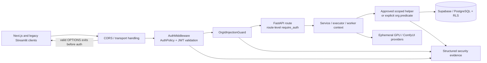

# Auth Tenant Isolation Remediation Bugfix Design

## Overview

This design updates the existing bugfix plan using `.kiro/specs/deep-audit-report.md` and `.kiro/specs/phase-1-nav-auth.md` as binding source documents. It preserves the security contract in `bugfix.md` and the validated defense-in-depth architecture where compatible, but expands the plan to cover the complete ordered Phase 1 navigation/auth scope.

The repository is **not** represented as fixed by this document. No application code, branches, staging environment, credentials, migrations, or deployment are claimed to be complete. This is an implementation and verification design only.

The central security fact is explicit: `backend/aios/mcp/server.py` is clean/current after its auth and tenant-isolation pass. The remaining Brain leak is the executor bridge in `backend/aios/execution/tools.py`, which bypasses MCP middleware. The first implementation item therefore repairs the bridge; it does not reopen or duplicate the already-authenticated MCP server path.

Phase 1 is ordered as follows:

1. Thread trusted `org_id` through the six affected Brain executors in `backend/aios/execution/tools.py` across the workspace variants.
2. Repair the 19+ unscoped Supabase queries in `backend/api_v1.py` using application-layer predicates or approved scoped helpers.
3. Protect and repair the native `/projects` and `/talent` routes in `backend/main.py`.
4. Attach auth headers to every `dashboard/api_client.py` request while retaining Streamlit as legacy/admin until parity.
5. Make worker organization context explicit and mandatory; remove the hardcoded development UUID and audit worker database helpers.
6. Re-include `auth_router` in all six agent worktree variants, with branch/worktree coordination treated as an operational task.
7. Build the missing story-engine router: the verified baseline is 0 of 22 endpoints, although models and logic exist.
8. Implement and test the actual 33-route V1-to-V2 migration map.
9. Centralize protected frontend API access through `frontend/src/lib/api.ts`, classify every raw-fetch caller, and implement 401 refresh/redirect behavior.
10. Rewrite the AppShell/navigation experience around START → CAST → WRITE → MAKE → PUBLISH, respecting frozen shared components and lane ownership.
11. Define the START page and route/auth matrix.
12. Enforce credential expiry and add `ProviderType.USER_API_KEY`; defer persistence migration and rotation automation.
13. Use the verified 11-value frame grid.

The design continues to treat tenant isolation as an application-layer guarantee backed by Supabase RLS, not as an RLS-only behavior. Valid same-tenant behavior, exact public probes, CORS preflight, approved local/test fallback, and documented system/reference data remain preservation requirements.

## Architecture



The effective request order remains:

1. CORS/transport handling completes a valid `OPTIONS` preflight before auth rejection.
2. Request correlation is established.
3. `AuthMiddleware` validates non-public credentials through one authoritative `AuthPolicy`.
4. `OrgIdInjectionGuard` rejects client-controlled organization selectors.
5. Route-level `require_auth` provides defense-in-depth on explicitly protected routes.
6. Services, executors, workers, and repositories use trusted tenant context.
7. Supabase RLS remains a secondary backstop.

Starlette middleware insertion order is not self-evident; implementation must include a sentinel test proving the effective order rather than relying on source order.

## Component Responsibilities

| Component | Responsibility | Boundary / non-responsibility |
|---|---|---|
| `AuthPolicy` and `PUBLIC_PROBE_ALLOWLIST` | Solely interpret auth settings, exact public routes, CORS preflight exemption, dark launch, enforcement, and startup validation | Does not select an organization from client input or query tenant data |
| `AuthMiddleware` | Validate JWT signature/expiry/claims, attach trusted request identity, emit structured decisions | Does not replace route authorization or accept client `org_id` |
| `OrgIdInjectionGuard` | Reject `org_id`, `orgId`, `org-id`, and `organization_id` query selectors on guarded surfaces | Does not infer a tenant or grant authorization |
| `backend/main.py` | Register the production security stack, retain router registration, and protect native routes | Does not implement a second auth policy |
| `backend.auth.require_auth` / `optional_auth` | Route-level identity and membership dependencies using the same policy | Must not read independent auth environment variables or pass null tenant context downstream |
| `backend/aios/mcp/server.py` | Current authenticated MCP boundary; preserve its existing `MCPClientDep` and org propagation | Not the location of the Brain bridge leak; do not duplicate or weaken its auth |
| `backend/aios/execution/tools.py` | Receive trusted `org_id` from the Brain bridge and pass it to all six affected executors and scoped data operations | Must not derive org from prompt, tool arguments, or an unauthenticated caller |
| `backend/api_v1.py` and approved helpers | Apply organization predicates to every tenant-owned read/write path | Must not rely on record ID or RLS alone |
| `backend/worker.py` | Require validated worker organization/job context for service-role polling and lifecycle mutation | Must not use a hardcoded UUID or unsafe environment fallback |
| `story_engine` router | Expose typed, authenticated, org-scoped story operations over existing models/logic | Does not build CAST/WRITE/MAKE product features beyond the route contract |
| `frontend/src/lib/api.ts` | Single authenticated transport, token attachment, structured errors, retry policy, and 401 refresh/redirect | Does not send client-selected `org_id` |
| `dashboard/api_client.py` | Legacy/admin transport that attaches the current bearer token to every request | Streamlit is not the primary product navigation and is not deleted in Phase 1 |
| Frontend lane agents | Own page-local START/CAST/WRITE/MAKE/PUBLISH work under `LANES.json` | Backend lane must not edit frontend lane-owned pages or frozen shared components |
| Platform/CTO operator | Own staging access, secret-manager credentials, migrations, enforcement configuration, and sign-off evidence | No credentials or staging completion are implied by this design |

## Glossary

- **Bug_Condition (C)**: An input or operation that can bypass authentication, organization isolation, trusted worker context, valid route migration, or the Phase 1 acceptance gates.
- **Property (P)**: The required result for a buggy input: structured rejection, no foreign data exposure/mutation, valid preflight, valid redirect, or an uncompleted/`BLOCKED` gate.
- **Preservation**: Existing valid same-tenant, public-probe, preflight, and approved legacy behavior that must remain unchanged except for required security headers, predicates, and navigation redirects.
- **Trusted `org_id`**: Organization identity derived from validated JWT membership, a validated worker job context, or an explicitly authorized system context. It is never derived from a client query/body/path selector.
- **Direct tenant ownership**: The queried table has its own organization column; every applicable read and mutation requires a bound organization predicate.
- **Inherited tenant ownership**: A child record is scoped by a parent chain that terminates at a trusted organization-owned record.
- **System/shared data**: Data explicitly classified as non-tenant-owned, with an owner, reason, write policy, and regression test recorded in the query inventory.
- **Brain executor bridge**: The code path in `backend/aios/execution/tools.py` that invokes tool executors outside the MCP server middleware.
- **MCP boundary**: `backend/aios/mcp/server.py`, explicitly current and authenticated in the baseline audit.
- **Auth router**: `backend/auth_router.py` and its registration in each agent worktree variant; branch/worktree status is an operational coordination concern, not evidence about this checkout.
- **Phase 1 navigation**: START → CAST → WRITE → MAKE → PUBLISH. Feature builds inside CAST, WRITE, MAKE, and PUBLISH are later work unless explicitly listed as auth/navigation plumbing.
- **BYO API**: User/provider credential orchestration and provider selection. It is not resale of GPU capacity.
- **Frame grid**: The allowed H3 temporal frame-count set: `124, 141, 209, 226, 243, 260, 277, 294, 362, 480, 600`.

## Bug Details

### Bug Condition

The defects are distributed across backend authorization boundaries, direct database access, worker execution, frontend transport, route migration, and missing navigation/API surfaces. The current behavior must be treated as unverified until each ordered scope item passes its gates.

**Formal specification:**

```text
FUNCTION isBugCondition(input)
  INPUT: Request, QueryOperation, WorkerOperation, FrontendCall, RouteMigration,
         CredentialLookup, NavigationBuild, or RolloutAction
  OUTPUT: boolean

  IF input is Request THEN
    RETURN (
      input.method != OPTIONS
      AND input.path NOT IN PUBLIC_PROBE_ALLOWLIST
      AND input lacks a valid non-expired bearer JWT
    )
    OR (
      input contains org_id, orgId, org-id, or organization_id
      AND input reaches a guarded handler
    )
    OR (
      input.authenticated_org != input.record_org
      AND input.operation is tenant-scoped
    )
  END IF

  IF input is BrainExecutorCall THEN
    RETURN input.executor IN SIX_AFFECTED_EXECUTORS
           AND input.org_id is absent or not trusted
           AND input.operation can read or mutate tenant data
  END IF

  IF input is QueryOperation THEN
    RETURN input is tenant-scoped
           AND NOT input.has_application_org_predicate
           AND NOT input.has_valid_inherited-parent check
           AND NOT input.has_documented_system exemption
  END IF

  IF input is WorkerOperation THEN
    RETURN input.operation IN {poll, claim, complete, fail}
           AND input.targets organization-owned jobs
           AND (
             input.org_id is missing
             OR input.org_id is not a validated UUID
             OR input lacks .eq("org_id", trusted_job_org_id)
           )
  END IF

  IF input is FrontendCall THEN
    RETURN input is protected
           AND input bypasses frontend/src/lib/api.ts
           AND input is not an explicitly classified health/probe transport
  END IF

  IF input is RouteMigration THEN
    RETURN input.source is in the 33-route inventory
           AND input has no valid V2 destination
           OR query parameters are dropped
           OR editor/models special behavior is flattened incorrectly
  END IF

  IF input is CredentialLookup THEN
    RETURN input.status == ACTIVE
           AND input.expires_at is present and in the past
           AND lookup returns the record as usable
  END IF

  IF input is RolloutAction or NavigationBuild THEN
    RETURN required dependency/evidence is absent
           AND action is marked complete
  END IF

  RETURN false
END FUNCTION
```

**Expected-result specification:**

```text
FUNCTION expectedBehavior(result)
  RETURN (
    result is the applicable structured 401/403/404/422 rejection
    OR result contains no foreign-organization data or mutation
    OR result is a successful unauthenticated CORS preflight
    OR result is a valid 301/interstitial preserving query context
    OR result is an expired credential treated as inactive
    OR result remains NOT_READY/BLOCKED until evidence exists
  )
END FUNCTION
```

### Concrete Examples

1. A Brain tool invoked directly through `execution/tools.py` reads talent for organization A while the caller is in organization B. The fixed bridge passes trusted B context into the executor; the operation returns no A data.
2. `GET /api/v1/talent` reaches one of the 19+ unscoped Supabase queries. The fixed query adds the validated organization predicate or calls an approved scoped helper.
3. `GET /talent` currently can reach `database.get_talent()` without `org_id`, causing the reported `TypeError`. The fixed route requires `require_auth`, extracts `AuthUser.org_id`, and passes it to the helper.
4. A worker starts without `--org-id`. The fixed CLI exits with a clear validation error; it does not use `WORKER_ORG_ID` as an unsafe fallback and never uses the historical development UUID.
5. A valid browser `OPTIONS` preflight has no bearer token. CORS handles it before auth rejection and protected route logic is not invoked.
6. `GET /editor` shows a Phase 1 interstitial linking to WRITE/MAKE rather than being treated as an ordinary direct redirect; `/models` routes character-model requests to CAST and generation-model requests to the Admin models destination.
7. A raw protected `fetch()` in a page omits `Authorization`. It is migrated to `api.*`; a 401 then follows the existing refresh-or-login redirect contract rather than producing a blank page.
8. A credential is marked `ACTIVE` but `expires_at` is in the past. `_find_active()` returns no usable record; no persistence migration or rotation automation is implied in Phase 1.
9. A requested video frame count of `216` or `280` is rejected; the accepted grid is exactly `124, 141, 209, 226, 243, 260, 277, 294, 362, 480, 600`.
10. A staging gate is reported complete without controlled access, migration evidence, or two-organization test users. The gate remains `BLOCKED`; no code or credential status is inferred from the design.

## Expected Behavior

### Security Contract Preservation

The following contract from `bugfix.md` remains binding:

- All non-public, non-preflight routes require a valid, non-expired JWT in staging and production.
- `PUBLIC_PROBE_ALLOWLIST` is the single exact allowlist for public probes, auth bootstrap routes, and explicitly permitted preflight entries. Near-matches and general application routes remain protected.
- Effective security order is `AuthMiddleware -> OrgIdInjectionGuard -> route-level require_auth -> handler` after CORS preflight handling.
- Client organization selectors are rejected with HTTP 422 and `ORG_ID_INJECTION_REJECTED`; no handler or database operation runs.
- `backend.auth.require_auth` stays explicitly attached to `GET /projects`, `GET /talent`, and `POST /talent`.
- A missing membership, missing worker job context, or null trusted organization produces the canonical structured membership/authorization failure before validation or database access.
- Application-layer organization predicates are required even when RLS exists. Cross-tenant reads return no visible record and cross-tenant updates/deletes leave the record unchanged.
- Service-role worker operations are scoped independently of HTTP middleware.
- Valid `OPTIONS` preflights succeed without a user JWT and do not invoke protected route logic.
- Staging and production fail closed unless the authoritative policy is explicitly enforcing. Dark launch is controlled non-production observation only; its one flip trigger is `AUTH_ENFORCEMENT_FLIP=true`.
- Rollback cannot disable enforcement. Only an immediately prior enforcing release is a valid rollback target; otherwise traffic is restricted/shepherded while fixing forward.
- No secret, bearer token, service-role key, refresh token, password, or unnecessary PII is logged or returned.

### Navigation and Transport Contract

- Public routes are `/`, `/login`, `/auth/google`, `/auth/callback`, `/auth/logout`, `/pricing`, and exact health/readiness/documentation probes as represented by the authoritative route policy.
- `/start`, `/cast`, `/write`, `/make`, `/publish`, `/settings`, `/admin`, `/brain`, and protected API/AIOS routes require auth.
- `frontend/src/lib/api.ts` is the single approved protected transport. Every protected caller attaches the Supabase bearer token, and a 401 invokes the existing session refresh or login redirect path.
- Streamlit remains a legacy/admin surface until authenticated parity is verified; Phase 1 does not delete it or claim parity prematurely.
- The five-step shell is responsive at the three specified breakpoints: full horizontal navigation at `>=1024px`, scrollable tabs at `768–1023px`, and a hamburger/current-step control below `768px`.
- START is an authenticated project dashboard, not the public landing page. It has defined loading skeleton, recoverable error/retry, empty-project CTA, and request-correlation behavior.

### Preservation Requirements

**Unchanged behaviors:**

- Valid same-tenant calls preserve existing response shapes and business outcomes after trusted organization predicates are added.
- Exact public probes and valid CORS preflights preserve their existing semantics.
- Approved local/test fallback remains available only through the unified policy and never in staging or production.
- `backend/aios/mcp/server.py` remains authenticated/current; no Phase 1 change may weaken its `MCPClientDep` or org propagation contract.
- Streamlit remains available as legacy/admin until parity; it is not silently removed.
- System/shared reference data remains unfiltered only when the audit records its classification, owner, reason, and test.
- Credential secrets remain encrypted/masked and are never exposed by adding `expires_at` or `USER_API_KEY`.
- Existing story-engine model and scene-planning logic remains reusable; the new router adds an API boundary rather than rewriting domain behavior.
- Product generation, training, publishing, GPU provisioning, and unrelated response schemas are not changed merely by this auth/navigation design.

**Scope:** Inputs outside the bug condition must be behaviorally unchanged except for required auth headers, structured rejection, tenant predicates, expiry handling, explicit 301/interstitial migration, and the Phase 1 shell/START route contract.

### Route/Auth Matrix

| Route/surface | Auth | Phase 1 behavior |
|---|---:|---|
| `/` | No | Public landing; not the START dashboard |
| `/login` | No | Auth entry point |
| `/auth/google`, `/auth/callback`, `/auth/logout` | No | Auth bootstrap/logout, exact allowlist entries |
| `/pricing` | No | Public pricing page; monetization providers are later product work |
| `/health`, `/ready`, docs/probe routes | No | Exact public probes only |
| `/start` | Yes | Project dashboard and onboarding state |
| `/cast` | Yes | Navigation destination and auth boundary; feature build later |
| `/write` | Yes | Navigation destination and auth boundary; story API plumbing only in Phase 1 |
| `/make` | Yes | Navigation destination and auth boundary; feature build later |
| `/publish` | Yes | Navigation destination and auth boundary; feature build later |
| `/settings`, `/admin`, `/brain` | Yes | Protected existing surfaces |
| `/api/v1/*` | Yes unless exact auth exception | Tenant-scoped API boundary |
| `/aios/*` | Yes | Includes authenticated MCP and Brain paths |

## Hypothesized Root Cause

1. **Brain/MCP boundary split:** MCP server requests are authenticated, but direct Brain executor calls bypass that middleware and do not consistently carry trusted `org_id`.
2. **Legacy direct Supabase access:** `api_v1.py` contains 19+ reads/writes over tenant-owned tables without application predicates; RLS was treated as sufficient.
3. **Native-route omission:** `backend/main.py` lacks route-level auth for `/projects` and `/talent`, and calls helpers without their required `org_id`, producing the current `TypeError`.
4. **Workspace divergence:** Six agent worktree variants need coordinated auth-router re-inclusion and the executor bridge fix; a single checkout cannot prove branch state.
5. **Worker fallback:** `backend/worker.py` permits a historical hardcoded development UUID or unsafe environment fallback, and service-role operations execute outside HTTP middleware.
6. **Transport fragmentation:** Dashboard requests omit auth headers, while frontend pages mix `api.*`, `authFetch`, and raw `fetch()` calls. This makes backend enforcement and 401 recovery inconsistent.
7. **Missing route/API surface:** Story models and logic exist, but no FastAPI story router is mounted; earlier “50+ endpoints” claims are unsupported. The verified implementation baseline is 0 of 22.
8. **Stale migration and UX assumptions:** The prior migration inventory undercounts the route audit, `/editor` and `/models` require special handling, and the shell still reflects old workspaces.
9. **Credential schema drift:** `CredentialRecord` has no `expires_at`, `_find_active()` ignores expiry, and `ProviderType` lacks `USER_API_KEY`.
10. **Stale frame-grid contract:** Existing planning materials use an incomplete four-value set instead of the verified 11-value set.
11. **Product-boundary drift:** BYO API has been conflated with GPU resale, and later monetization/integration work has been mixed into Phase 1.

## Correctness Properties

Property 1: Bug Condition - Trusted Tenant Enforcement

_For any_ input where `isBugCondition(input)` returns true because authentication, organization propagation, application scoping, worker context, credential expiry, or route/API protection is missing, the fixed system `F'` SHALL return the applicable structured rejection, no-data/no-mutation result, expired-credential result, or incomplete gate; it SHALL not invoke an unprotected handler, expose foreign data, mutate a foreign record, or use a hardcoded tenant.

**Validates: Requirements 2.1, 2.2, 2.4, 2.5, 2.11, 2.13, 2.17, 2.18**

Property 2: Preservation - Valid Existing Behavior

_For any_ input where `isBugCondition(input)` returns false, the fixed system SHALL preserve valid same-tenant responses, exact public probes, CORS preflight behavior, approved local/test fallback, MCP server authentication, shared-data exemptions, and existing credential secrecy, except for required auth headers, predicates, expiry checks, and documented navigation migration.

**Validates: Requirements 3.1, 3.2, 3.3, 3.4, 3.5, 3.6, 3.11, 3.13**

Property 3: Audit Completeness - No Unclassified Tenant Operation

_For any_ repository occurrence discovered by searches for literal or non-literal `.table(...)`, `.from_()`, dynamic table names, direct Supabase wrappers, worker job lifecycle operations, or `optional_auth` tenant paths, the audit SHALL contain exactly one ownership classification and evidence of an application predicate, trusted parent check, or explicit exemption. Any unclassified or RLS-only tenant operation SHALL fail acceptance.

**Validates: Requirements 2.5, 2.6, 2.9, 2.11, 2.18**

Property 4: Rollout Safety - Gates and Rollback Remain Fail-Closed

_For any_ rollout, branch-coordination, staging, or rollback action where required evidence is absent, the system/process SHALL retain the affected gate as `BLOCKED`, SHALL not claim code or credentials are fixed, and SHALL not disable authentication in staging or production. Dark launch SHALL remain non-production observation and SHALL not count as acceptance.

**Validates: Requirements 2.3, 2.6, 2.7, 2.8, 2.10, 2.14, 2.17**

Property 5: Frontend Contract - Protected Calls Use the Authenticated Transport

_For any_ protected frontend call that is not an approved health/probe or internal implementation call, the fixed frontend SHALL route through `frontend/src/lib/api.ts`, attach the current bearer token, avoid client `org_id` selectors, and on 401 follow the refresh-or-login redirect contract. A raw protected caller or unclassified probe caller fails the migration audit.

**Validates: Requirements 2.8, 2.15**

Property 6: Phase 1 Navigation and API Inventory

_For any_ route in the 33-route migration map or endpoint in the 22-endpoint story inventory, the implementation SHALL provide a valid V2 destination or mounted authenticated route contract, preserve supported query parameters, and record the appropriate lane/ownership and test evidence. `/editor` interstitial behavior and `/models` split behavior SHALL not be reduced to an invalid generic redirect.

**Validates: Requirements 2.12, 2.16**

## Fix Implementation

### Ordered Phase 1 Workstreams

The following order is normative. A later item may be designed in parallel, but its acceptance cannot override an earlier blocked security dependency.

#### 1. Brain executor bridge: six executors and workspace variants

**Target:** `backend/aios/execution/tools.py` in the main checkout and each applicable workspace variant.

- Identify the six affected executor functions from the shared implementation, not by assuming every tool in the module is affected.
- Add a required trusted `org_id`/tenant context parameter to the bridge signature and thread it into all six executors.
- Apply direct organization predicates or approved scoped helpers for talent, assets, publishing posts, and any other tenant-owned records each executor touches.
- Reject missing/null context before validation or database access; never accept `org_id` from tool arguments or prompt text.
- Preserve `backend/aios/mcp/server.py` as clean/current. MCP remains authenticated through `MCPClientDep`; this item repairs only the bypassing Brain bridge.
- Test the main checkout and coordinate the equivalent changes across workspace variants. The design does not claim those branches exist or are synchronized.

#### 2. `backend/api_v1.py`: 19+ query repair

- Inventory and repair every finding listed by the audit, including talent, scenes, shots, LoRA versions, assets, storyboards, and talent relationships.
- Prefer existing approved scoped helpers where they provide the correct ownership proof; otherwise add a bound `.eq("org_id", trusted_org_id)` to every applicable select/detail/update/delete and overwrite organization on inserts.
- Validate inherited ownership for child records. Record-only access is never sufficient.
- Respect the `backend/api_v1.py` single-file mutex: backend work must be serialized by the orchestrator; this design does not imply concurrent branch edits.
- Do not claim the 19+ findings are fixed until every occurrence has a test or inventory evidence.

#### 3. Native routes in `backend/main.py`

Keep the existing paths and response shapes while adding explicit route-level defense-in-depth:

```text
GET  /projects -> user: AuthUser = Depends(require_auth)
GET  /talent   -> user: AuthUser = Depends(require_auth)
POST /talent   -> user: AuthUser = Depends(require_auth)
```

Each handler passes `str(user.org_id)` to `get_projects(org_id)`, `get_talent(org_id)`, and `create_talent(data, org_id)`. Missing membership returns the canonical structured authorization error. No handler accepts a client organization selector. Tests must exercise route dependencies without middleware as an independent defense-in-depth check.

#### 4. Dashboard transport and legacy parity

- Update `dashboard/api_client.py` so every GET/POST/PUT/PATCH/DELETE/upload request attaches the current bearer token and preserves structured errors/request IDs.
- Do not expose service-role keys or fabricate a dashboard tenant.
- Retain Streamlit as legacy/admin until authenticated parity is demonstrated. A dashboard migration is not evidence that all Streamlit pages are feature-complete.
- Add tests for missing, valid, expired, and refreshed token behavior for every request helper.

#### 5. Worker organization enforcement

- Make `--org-id` mandatory in `backend/worker.py` and validate it as a UUID before worker startup; the CLI argument is the sole accepted worker organization source for this Phase 1 contract.
- Remove the hardcoded development UUID and remove any `WORKER_ORG_ID` or other environment/hardcoded fallback. Missing or malformed `--org-id` must fail before worker startup, validation, or database access.
- Audit `backend/database.py` helper calls and the worker's service-role poll, claim, complete, and fail operations individually.
- Derive `trusted_job_org_id` from validated job context and apply `.eq("org_id", trusted_job_org_id)` or an equivalent bound predicate to every directly organization-owned `jobs` operation.
- Missing job context fails before validation/database access and blocks P3 acceptance.
- Audit related worker scripts for references to the historical UUID without claiming those scripts are fixed until verified.

#### 6. Auth-router worktree coordination

- Verify/re-include `auth_router` on all six agent worktree variants named by the Phase 1 source.
- Treat branch creation, cherry-picking, conflict resolution, and per-worktree tests as operational coordination tasks owned by the orchestrator/appropriate lanes.
- This main checkout does not claim to contain six branches, and this design does not use a local file state as proof of branch parity.
- Main-entrypoint auth registration must still be tested independently.

#### 7. Story-engine router: verified 0 of 22 endpoint baseline

Models in `backend/story_engine/models.py` and logic in `continuity_checker.py`/`scene_builder.py` exist, but no FastAPI router currently exposes the story contract. The older “50+ endpoints” claim is rejected; Phase 1 defines exactly 22 route contracts:

| # | Method and route | Scope / response contract |
|---:|---|---|
| 1 | `GET /api/v1/story/universes` | Auth; paginated `{items,total,limit,offset}` |
| 2 | `POST /api/v1/story/universes` | Auth; 201 `UniverseResponse` |
| 3 | `GET /api/v1/story/universes/{universe_id}` | Auth + org ownership; `UniverseResponse` |
| 4 | `PATCH /api/v1/story/universes/{universe_id}` | Auth + editor role; updated `UniverseResponse` |
| 5 | `DELETE /api/v1/story/universes/{universe_id}` | Auth + editor role; 204 soft/delete contract |
| 6 | `GET /api/v1/story/universes/{universe_id}/characters` | Auth + parent org; paginated `CharacterResponse` items |
| 7 | `POST /api/v1/story/universes/{universe_id}/characters` | Auth + editor role; 201 `CharacterResponse` |
| 8 | `PATCH /api/v1/story/characters/{character_id}` | Auth + inherited universe org; updated `CharacterResponse` |
| 9 | `DELETE /api/v1/story/characters/{character_id}` | Auth + inherited universe org; 204 |
| 10 | `GET /api/v1/story/universes/{universe_id}/episodes` | Auth + parent org; paginated `EpisodeResponse` items |
| 11 | `POST /api/v1/story/universes/{universe_id}/episodes` | Auth + editor role; 201 `EpisodeResponse` |
| 12 | `GET /api/v1/story/episodes/{episode_id}` | Auth + inherited universe org; `EpisodeResponse` |
| 13 | `PATCH /api/v1/story/episodes/{episode_id}` | Auth + editor role; updated `EpisodeResponse` |
| 14 | `DELETE /api/v1/story/episodes/{episode_id}` | Auth + editor role; 204 |
| 15 | `GET /api/v1/story/episodes/{episode_id}/scenes` | Auth + inherited universe org; paginated `SceneResponse` items |
| 16 | `POST /api/v1/story/episodes/{episode_id}/scenes` | Auth + editor role; 201 `SceneResponse` |
| 17 | `PATCH /api/v1/story/scenes/{scene_id}` | Auth + inherited episode org; updated `SceneResponse` |
| 18 | `DELETE /api/v1/story/scenes/{scene_id}` | Auth + editor role; 204 |
| 19 | `GET /api/v1/story/scenes/{scene_id}/shots` | Auth + inherited episode/universe org; paginated `ShotResponse` items |
| 20 | `POST /api/v1/story/scenes/{scene_id}/shots` | Auth + editor role; 201 `ShotResponse` |
| 21 | `PATCH /api/v1/story/shots/{shot_id}` | Auth + inherited scene org; updated `ShotResponse` |
| 22 | `DELETE /api/v1/story/shots/{shot_id}` | Auth + editor role; 204 |

Implementation requirements:

- Add typed Pydantic request/response schemas and a router mounted in the active app; do not expose dataclass dictionaries as an implicit API contract.
- Resolve `org_id` only from `require_auth`/membership and parent ownership. All IDs are UUIDs at the boundary.
- Use paginated list responses and bounded validation. Cross-tenant detail/update/delete behaves as not-found or canonical denial without existence leakage.
- `scene_builder.plan_shots`, `estimate_scene_duration`, and continuity logic remain domain services behind the router.
- Add `X-Request-ID` correlation and structured errors. No route claims to implement feature builds in WRITE.

#### 8. Actual 33-route migration map

This is the route inventory to implement and verify; it is not a claim that all destination pages already exist. Every destination must be a valid V2 route contract before enabling a 301. Query parameters must be forwarded, not discarded, and deprecation must be observable for 90 days unless noted.

| # | V1 route | Phase 1 destination / behavior | Handling |
|---:|---|---|---|
| 1 | `/` | `/` public landing | Keep |
| 2 | `/home` | `/start` | 301, 90d |
| 3 | `/create` | `/make` | 301, 90d |
| 4 | `/editor` | `/editor` interstitial linking to `/write` and `/make` | Interstitial now; direct 301 after deprecation |
| 5 | `/production` | `/write` | 301, 90d |
| 6 | `/training` | `/cast?tab=training` | 301 + query forwarding, 90d |
| 7 | `/talent` | `/cast` | 301, 90d |
| 8 | `/workflows` | `/make?tab=workflow` | 301 + query forwarding, 90d |
| 9 | `/analytics` | `/publish?tab=analytics` | 301 + query forwarding, 90d |
| 10 | `/projects` | `/start` | 301, 90d |
| 11 | `/models` | `/cast?section=models` or `/admin/models?section=generative` by model type | Split destination; never one generic redirect |
| 12 | `/jobs` | `/make?tab=queue` | 301, 60d |
| 13 | `/brain` | `/brain` | Keep |
| 14 | `/login` | `/login` | Keep |
| 15 | `/assets` | `/publish?tab=library` | 301 + query forwarding, 90d |
| 16 | `/pricing` | `/pricing` | Keep |
| 17 | `/story` | `/story` in Phase 1; reserved `/write` migration after Phase 2 | Keep now; deprecate later |
| 18 | `/settings` | `/settings` | Keep |
| 19 | `/admin` | `/admin` | Keep |
| 20 | `/admin/fleet` | `/admin?tab=fleet` | 301 + query forwarding, 90d |
| 21 | `/admin/ise` | `/admin?tab=ise` | 301 + query forwarding, 90d |
| 22 | `/admin/keys` | `/admin?tab=keys` | 301 + query forwarding, 90d |
| 23 | `/admin/knowledge` | `/admin?tab=knowledge` | 301 + query forwarding, 90d |
| 24 | `/admin/downloads` | `/admin?tab=downloads` | 301 + query forwarding, 90d |
| 25 | `/publish` | `/publish` | Keep |
| 26 | `/generate` | `/make?tab=generate` | 301 + query forwarding, 90d |
| 27 | `/video` | `/make?tab=video` | 301 + query forwarding, 90d |
| 28 | `/audio` | `/make?tab=audio` | 301 + query forwarding, 90d |
| 29 | `/campaigns` | `/start?tab=campaigns` | 301 + query forwarding, 90d |
| 30 | `/calendar` | `/publish?tab=calendar` | 301 + query forwarding, 90d |
| 31 | `/brands` | `/start?tab=brands` | 301 + query forwarding, 90d |
| 32 | `/teams` | `/settings?tab=team` | 301 + query forwarding, 90d |
| 33 | `/company` | `/settings?tab=organization` | 301 + query forwarding, 90d |

The redirect implementation may use `frontend/next.config.ts` redirects or middleware, but it must test status, valid destination, query forwarding, deprecation logging, the `/editor` interstitial, and `/models` split behavior. A redirect to an unbuilt/nonexistent destination is a failure, not a successful migration.

#### 9. Frontend API centralization and caller classification

- Extend or use `frontend/src/lib/api.ts` as the sole protected transport with typed `get/post/put/patch/delete/upload/stream` behavior.
- Preserve the Supabase session token source; do not read raw `localStorage` or send `org_id` from the client.
- Migrate confirmed protected raw callers including `brain-dock.tsx`, `feedback-buttons.tsx`, `topbar.tsx`, `app/story/page.tsx`, talent relationship/media/LoRA/voice sections, generation-result, analytics, create audio hooks, `frontend/src/lib/hooks.ts`, and error logging where its endpoint is protected.
- Classify approved probe calls such as health-store and `useOnlineStatus` separately; they are not evidence that all raw fetches are safe.
- Existing `authFetch` callers must either be routed through the canonical client or explicitly classified as the compatibility layer during migration.
- Do not claim zero raw fetches until health/probe calls and all protected callers have been inventoried and classified.
- On HTTP 401, attempt the existing session refresh once where supported; if refresh fails or the session is absent, clear session state and redirect to `/login` without a retry loop. Preserve structured errors and request IDs.

#### 10. AppShell and five-step navigation

The target model is `START → CAST → WRITE → MAKE → PUBLISH` with responsive behavior at the three breakpoints stated above. Active/completed/future states and the mobile current-step label are part of the navigation contract.

The frontend shared-component directory is frozen for lane agents. Therefore:

- Do not directly edit `frontend/src/components/**` from the backend lane.
- Page-local navigation adapters and page work belong beside their owning page.
- The shared `AppShell`, `AuthGate`, `TopBar`, `StepIndicator`, and `NavDropdown` changes must be assigned to the appropriate frontend/integration lane under `LANES.json`; integration may alter frozen shared components serially.
- The design records frontend tasks and dependencies but does not claim the shell or pages are implemented.

CAST, WRITE, MAKE, and PUBLISH feature builds, pipeline controls, publishing integrations, LoRA training, and self-service deployment remain outside this Phase 1 auth/navigation remediation.

#### 11. START page scope

`/start` is a protected project dashboard. Phase 1 defines only the foundation:

- current organization/project context derived from auth;
- project list/status summaries using scoped APIs;
- create/open-project entry points where an existing API supports them;
- recent activity or empty state without unscoped aggregate queries;
- loading skeleton matching the layout;
- typed error state with retry and `X-Request-ID` support;
- empty state with a first-project CTA;
- responsive shell integration and route guard.

START is not a replacement for CAST/WRITE/MAKE/PUBLISH feature implementation. The public `/` landing page remains distinct.

#### 12. Credentials: expiry and provider type only

In `backend/credentials.py`:

- Add `expires_at: str | None = None` to `CredentialRecord` and include it in masked metadata where safe.
- Add `ProviderType.USER_API_KEY = "user_api_key"` without exposing secrets.
- Make `_find_active()` require `status == ACTIVE` and either null expiry or an expiry later than `datetime.now(UTC)`; malformed expiry must fail closed rather than mark the credential active.
- Ensure resolve/validate/store tests cover active, expired, revoked, rotated, null-expiry, and malformed-expiry records.
- Explicitly defer persistence migration for the new field and rotation automation to Phase 2/3. This design does not claim migration 034 or automation exists.
- BYO API is orchestration-layer pricing/provider credential management, not GPU resale. No BYO management feature build is in Phase 1 beyond expiry/provider-type compatibility.

#### 13. Frame grid

The only valid frame-grid set for Phase 1 is:

```text
124, 141, 209, 226, 243, 260, 277, 294, 362, 480, 600
```

Validation and UI contracts must reject values outside this set, including stale examples such as `216` and `280`. No four-value substitute is valid.

### Cross-Cutting Data-Access Rules

Every discovered database access follows this decision tree:

1. Missing trusted organization or inactive membership: canonical authorization error before validation/DB access.
2. Direct tenant table: bound organization predicate on reads/mutations; inserts overwrite organization; updates cannot change it.
3. Inherited tenant table: validate the parent chain to a trusted direct-owned parent.
4. Explicit system/shared data: documented owner, reason, sensitivity, write policy, and regression test.
5. Ambiguous/dynamic table: fail the audit and block acceptance.

The repository-wide audit must search `.table(`, `.from_(`, dynamic table-name construction, client wrappers, worker service-role calls, and every `optional_auth` tenant path. The audit artifact must record file, symbol/line, operation, resolved table, ownership class, trusted org source, predicate/parent check, exemption reason, remediation, reviewer, and status. Literal-table search alone is insufficient.

### Product Boundary Corrections

These corrections are binding for Phase 1 planning:

- BYO API concerns orchestration-layer provider credentials and pricing; it is not GPU resale.
- Stripe monetization for SFW creators and CCBill monetization for NSFW creators are later product work, not Phase 1 auth/navigation deliverables.
- CAST/WRITE/MAKE/PUBLISH feature builds, pipeline controls P1–P11, BYO credential management beyond expiry/provider type, MCP expansion, publishing integrations, LoRA training, and self-service deployment are out of scope.
- `backend/aios/mcp/server.py` remains explicitly clean/current; `backend/aios/execution/tools.py` is the Brain leak to remediate.

### Dependencies, Ordering, and Gates

| Gate | Depends on | Acceptance evidence |
|---|---|---|
| P0 backend isolation | 1–5 | Six executor tests, 19+ query inventory/tests, native-route auth/TypeError tests, dashboard/worker auth tests |
| P1 auth-router coordination | P0 baseline | Six worktree verification records and branch-specific tests; not inferred from main checkout |
| Story API | trusted auth and scoped repository pattern | 22 route contracts, schemas, 401/403/404/422/201 tests |
| Frontend transport | backend structured 401 contract | Classified caller inventory, token/401 tests, no unclassified protected caller |
| Navigation/START | frontend transport and route map | responsive shell, route matrix, START loading/error/empty/auth evidence |
| Credentials/frame grid | independent unit contracts | expiry/provider tests and exact 11-value validation |
| Staging verification | all prior implementation gates plus CTO provisioning | two-org tests, RLS-disabled/service-role checks, migration/config evidence |
| Final acceptance | all applicable gates | C7 suite, coverage, benchmark, audit, rollback evidence, non-goal review |

Dark launch may be used only in a named, controlled non-production environment with observable would-be decisions. The single enforcement flip is `AUTH_ENFORCEMENT_FLIP=true`; staging and production require enforcement from startup. Missing staging credentials, migrations, controlled access, or test users leaves the relevant gate `BLOCKED`.

### Rollback

- Never set `AUTH_ENFORCEMENT_FLIP=false` in staging or production.
- Never roll back to a release without middleware, route-level protection, executor org propagation, and application scoping.
- The only automatic rollback target is an immediately prior independently verified enforcing release. If none exists, restrict/shepherd traffic and fix forward.
- Frontend rollback must preserve token attachment and 401 handling; a 401 spike is not grounds to disable tenant isolation.
- Any rollback creates a new evidence record and reruns affected auth, tenant, route, and frontend contract gates.

### Implementation File Map

This is a planned ownership map, not a claim of changed files:

- Backend auth and native routes: `backend/main.py`, `backend/auth.py`, `backend/auth_router.py`, `backend/app/core/`, `backend/app/main.py`.
- Brain bridge and MCP preservation: `backend/aios/execution/tools.py`, `backend/aios/mcp/server.py`.
- Tenant sweep: `backend/api_v1.py`, `backend/database.py`, `backend/training/router.py`, `backend/production_intelligence/router.py`, `backend/worker.py`, `backend/data_access.py`, `backend/tenant_repo.py`.
- Worker and credentials: `backend/worker.py`, `backend/credentials.py`, related worker scripts.
- Story API: `backend/story_engine/router.py` and typed schemas/services selected during implementation.
- Frontend transport: `frontend/src/lib/api.ts`, `frontend/src/lib/hooks.ts`, and classified callers.
- Navigation/START: lane-owned `frontend/src/app/**`; frozen shared components only through the appropriate frontend/integration lane.
- Legacy dashboard: `dashboard/api_client.py`.
- Tests: `tests/unit/`, `tests/integration/`, and backend test locations used by the repository's pytest configuration.

## Testing Strategy

### Validation Approach

Testing follows the bug-condition methodology: establish counterexamples on an isolated/unfixed baseline where practical, verify the fix for generated bug-condition inputs, then verify preservation for non-buggy inputs. This design does not report any test as run or any branch/staging/credential state as complete.

Use pytest, pytest-asyncio, FastAPI/httpx TestClient, pytest-mock/unittest.mock, factory-boy where useful, Hypothesis for property tests, and pytest-cov. Unit tests mock DB/external services; integration tests use a controlled real database and mock external APIs such as B2/Vast.ai. Mark tests `unit`, `integration`, and `slow` as appropriate.

### Exploratory Bug-Condition Checks

1. Invoke each of the six Brain executors through the bridge without org context and record the counterexample; then assert missing context fails before DB access.
2. Run the `api_v1.py` query inventory and identify all 19+ audit findings; deliberately test an organization A/B record-ID operation.
3. Call native `/projects`, `/talent`, and `POST /talent` without auth and with valid auth; capture the current missing-auth/TypeError baseline and the expected fixed behavior.
4. Exercise every dashboard request helper with no token, a valid token, an expired token, and a refreshed token.
5. Start the worker without `--org-id`, with malformed UUID, and with a valid UUID; verify no historical hardcoded UUID is selected.
6. Verify auth-router registration separately in each worktree record; do not treat the main checkout as six branches.
7. Confirm story frontend calls currently hit the missing router baseline, then test each of the 22 route contracts after implementation.
8. Test all 33 migration entries, query forwarding, `/editor` interstitial, `/models` split, and invalid destination detection.
9. Enumerate every frontend raw fetch and classify health/probe, API-client internals, compatibility `authFetch`, or protected caller; any unclassified protected caller fails.
10. Test navigation at `>=1024px`, `768–1023px`, and `<768px`, and test START auth/loading/error/empty states.
11. Exercise expired credentials, null-expiry credentials, malformed expiry, and `USER_API_KEY` handling.
12. Exercise every frame-grid value plus invalid values `216`, `280`, zero, negative, and non-integer input.

### Fix Checking

```text
FOR ALL input WHERE isBugCondition(input) DO
  result := F'(input)
  ASSERT (
    result is the specified structured rejection
    OR result contains no foreign-organization data and no foreign mutation
    OR result is a successful valid preflight
    OR result is a valid redirect/interstitial preserving context
    OR result treats the credential as inactive
    OR result keeps the rollout/audit/staging gate BLOCKED
  )
END FOR
```

### Preservation Checking

```text
FOR ALL input WHERE NOT isBugCondition(input) DO
  original := F(input)
  fixed := F'(input)
  ASSERT observable_behavior(original) = observable_behavior(fixed)
      OR difference_is_limited_to_required_authentication,
         tenant predicates, expiry checks, and documented navigation migration
END FOR
```

### Unit Tests

Unit coverage must include:

- unified auth policy matrix, exact `PUBLIC_PROBE_ALLOWLIST`, middleware ordering, CORS-before-auth, JWT outcomes, and org-injection spellings/repeats;
- native route dependencies and trusted org helper arguments;
- all six executor signatures/context propagation, with `backend/aios/mcp/server.py` regression coverage proving its current authenticated path remains intact;
- each 19+ `api_v1.py` query classification or approved scoped helper;
- worker CLI required UUID, no hardcoded/unsafe fallback, and poll/claim/complete/fail predicates;
- `dashboard/api_client.py` headers on every method and safe 401 behavior;
- all 22 story routes' schemas, roles, ownership-chain checks, pagination, and structured errors;
- all 33 redirects, query forwarding, editor interstitial, models split, and valid destinations;
- frontend API centralization and classification of probe/internal/protected callers;
- START route/auth/state contracts and lane-owned navigation adapters;
- credential expiry/provider enum and exact frame-grid validation.

### Property-Based Tests

Use Hypothesis and map each test to a correctness property:

1. Generate non-allowlisted paths and invalid credentials; assert 401 and no handler call (Property 1).
2. Generate exact allowlist/preflight and near-match paths; assert only exact public behavior bypasses JWT (Properties 1/2).
3. Generate org IDs, ownership records, CRUD operations, and inherited parent chains; assert organization B cannot observe/mutate A (Properties 1/3).
4. Generate table classifications and dynamic names; assert tenant classes require predicates, inherited classes require parent checks, and unknown classes fail closed (Property 3).
5. Generate worker lifecycle operations and job contexts; assert every directly-owned jobs operation requires a validated trusted org predicate (Properties 1/3).
6. Generate policy matrices across local/test/staging/production; assert staging/production never resolve permissive and only the single flip enables enforcement (Property 4).
7. Generate frontend protected/probe calls and 401/refresh outcomes; assert token attachment, no client org selector, and one refresh-or-redirect path (Property 5).
8. Generate route/query inventories; assert every 33 route has a valid destination or documented keep/interstitial behavior and preserves query parameters (Property 6).
9. Generate credential status/expiry combinations; assert only non-expired active records resolve (Property 1/2).
10. Generate frame values around the accepted set; assert exactly the 11 values pass (Property 6).

Hypothesis passes are local evidence only and never substitute for controlled staging or branch coordination.

### Integration Tests

Controlled integration tests must include:

- production-style `backend.main:app` auth ordering, public probes, auth bootstrap routes, CORS preflight, native routes, and injection rejection;
- organization A/B list/detail/update/delete behavior with real records, including RLS-disabled or service-role-backed application-layer verification only in controlled staging;
- Brain bridge calls and MCP calls proving the former carries org context and the latter remains authenticated/current;
- worker service-role poll plus claim/complete/fail with trusted job context and direct jobs predicate;
- every optional-auth tenant path with null/missing membership behavior;
- dashboard and frontend API transport smoke tests with token, expiry, refresh, redirect, and probe classification;
- all 22 story endpoints with auth, org isolation, status codes, pagination, and response envelopes;
- all 33 migration destinations and query forwarding in a built frontend environment;
- responsive AppShell/START route/auth smoke tests owned by frontend lanes;
- query-audit acceptance proving every occurrence is classified and no worker lifecycle operation is missing;
- representative before/after auth-overhead benchmark using the same request mix/environment. Benchmark tooling is validation-only and never a runtime dependency.

### Coverage and Acceptance Gates

- New code targets at least 80% line coverage.
- Enforcement, fallback, allowlist, error, 401 refresh/redirect, worker-context, and credential-expiry branches each target at least 80% branch coverage; aggregate coverage cannot mask an under-covered category.
- Final C7 acceptance requires unit, property-based, integration, frontend contract, query-audit, benchmark, and route/story inventory evidence, or an explicit `BLOCKED` status for a missing CTO-owned staging prerequisite.
- No green local suite overrides a blocked staging gate.
- Acceptance must show the six ordered backend/security items before frontend/navigation acceptance, and must separately record lane/worktree coordination evidence.
- Final review must explicitly record that no application code, branch parity, staging, credential, Stripe/CCBill integration, BYO GPU resale, MCP expansion, publishing integration, LoRA training, self-service deployment, or other Phase 1 non-goal is being claimed by this design.

### Explicit Non-Goals

- No application code is changed by this design document.
- No claim that the six agent branches/worktrees exist, are merged, or are synchronized.
- No claim that staging is provisioned, credentials are available, migrations are applied, or tests have passed.
- No CAST, WRITE, MAKE, or PUBLISH feature build; no pipeline controls P1–P11.
- No BYO API management beyond `expires_at`/`USER_API_KEY` compatibility; BYO is orchestration-layer pricing, not GPU resale.
- No Stripe SFW monetization or CCBill NSFW creator monetization; both are later product work.
- No MCP expansion; the current MCP server remains clean/current.
- No publishing platform integration, LoRA training, or self-service deployment.
- No persistence migration or rotation automation for credentials; those are Phase 2/3.
- No broad database/RLS migration beyond the application-layer predicates and audit required here.
- No replacement of the existing bugfix contract with permissive rollout behavior.
