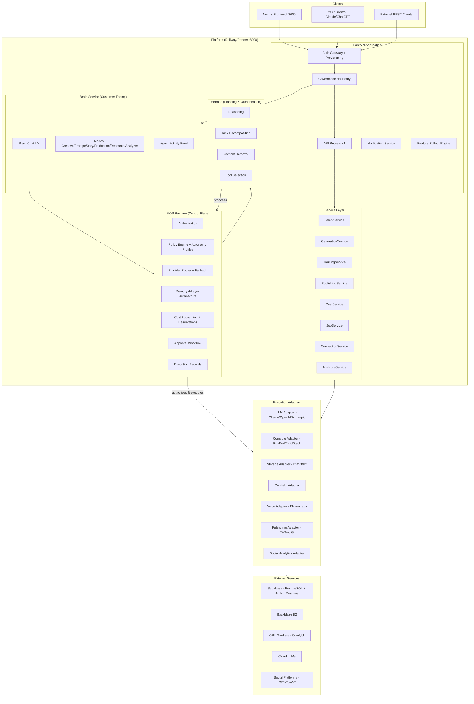
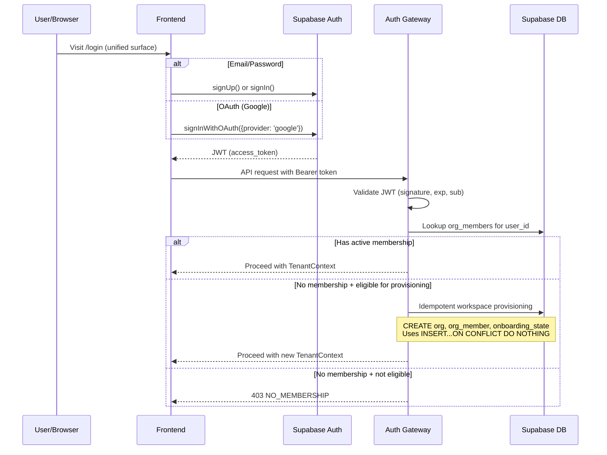
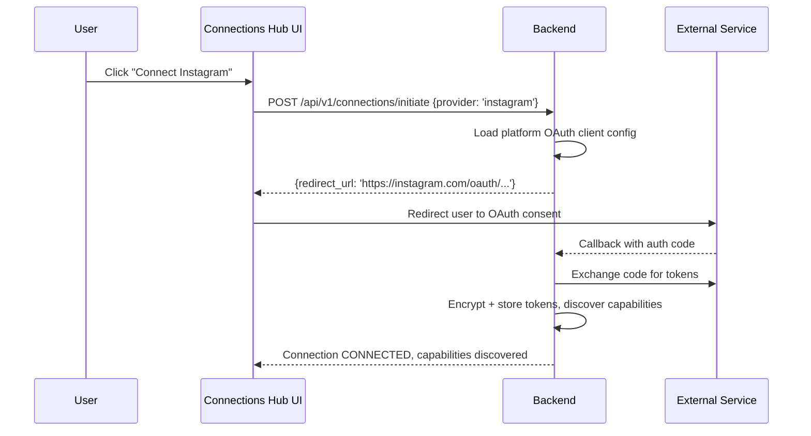
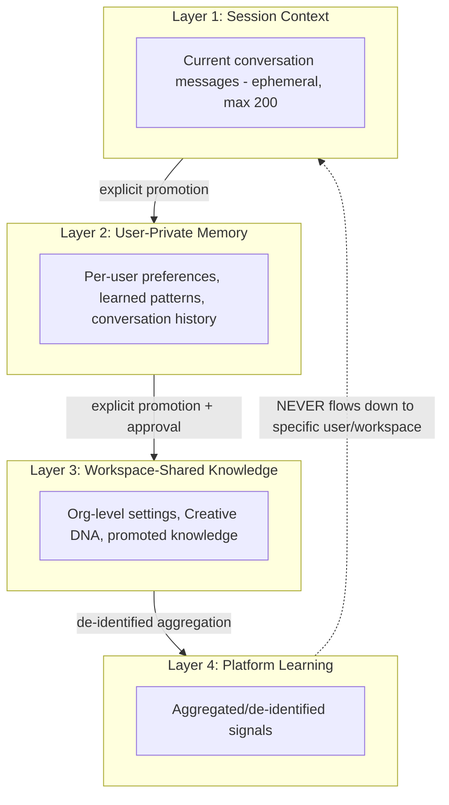
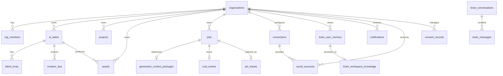

# Design Document

## AI Studio Production Design — Revision 4 FINAL

## Overview

This design converts AI Studio from a working prototype into a production-ready multi-tenant SaaS platform. It addresses 109 requirements across security, architecture, deployment, and feature completeness — prioritizing truth (schema reconciliation), security (auth + RLS + tenant isolation), and deployability (CI/CD + zero-error builds) before advancing creative features.

This is the CANONICAL FINAL design document. All Rev 3 amendments, Rev 4 amendments, and Amendment #2 reconciliation items are integrated. The specification is internally consistent and ready for tasks.md generation upon Founder approval.

The design preserves the existing 15+ router architecture, AIOS gateway, governance/approval patterns, and infrastructure RBAC while introducing rigorous layering, provider abstractions, a canonical governance boundary, unified connections management, compute economics, brain memory isolation, and platform operator capabilities.

**Amendment 2** adds: first-class consent subsystem, rights/takedown case management, tenant support sessions, expanded social intelligence architecture, connections capability model, MCP tool registry, control-plane/data-plane separation, brain context assembly pipeline, failure domain architecture, queue fairness, verification independence classes, and 9 additional correctness properties (18-26).

### Revision 4 Scope Additions

| Area | Requirements | Key Concepts |
|------|-------------|--------------|
| Authentication & Provisioning | R1 (amended), R84 | OAuth, idempotent workspace provisioning, unified signup/login |
| Connections Hub | R27 (amended), R85, R92 | Unified surface, OAuth-preferred, connection ownership |
| Compute Economics | R13 (amended), R86-R91 | Availability modes, multi-GPU, workload isolation, capacity |
| Brain Memory & Isolation | R25 (amended), R29 (amended), R93-R95 | 4-layer memory, user isolation, cross-tenant boundary |
| Platform Operations | R33 (amended), R97-R99 | Capability-based operators, autonomy profiles, activity feed |
| Workspace & Data | R96, R100, R104, R105 | Content ownership, undo, portability, deletion propagation |
| Intelligence | R43 (amended), R107, R108 | Social analytics, market intelligence |
| Feature Control | R19 (amended), R101, R102, R103, R106 | Rollout, notifications, fallback, privacy restrictions |
| Deployment Reality | R82-R83 (amended), R109 | "Demonstrated but unstable" classification |

### Amendment 2 Additions

| Area | Amendment Items | Key Concepts |
|------|----------------|--------------|
| Consent Subsystem | A2-004 | First-class consent records, scoped, versioned, revocable |
| Rights/Takedown | A2-005 | Case lifecycle, targeted restriction, legal holds |
| Tenant Support | A2-006 | Time-limited sessions, scope-limited, auditable |
| Social Intelligence | A2-007 through A2-012 | Expanded data model, provenance, sync lifecycle, experiments |
| Connections Model | A2-013, A2-014 | Capability ≠ permission, MCP tool registry |
| Brain Architecture | A2-015, A2-016, A2-031 through A2-033 | Provider agnosticism, BYO AI, context assembly pipeline |
| Storage Architecture | A2-018 through A2-021 | Control plane/data plane separation |
| Safety Clarifications | A2-024 through A2-026 | Age ambiguity fails closed, assertion ≠ consent |
| Schema/RLS | A2-027 through A2-030 | Target-state schema, entity RLS strategy, service-role boundary |
| Infrastructure | A2-037 through A2-040 | Long-form production, queue fairness, failure domains |
| Observability | A2-041, A2-042 | Extended correlation, audit vs activity distinction |
| Correctness | A2-049 | Properties 18-26 added |

### Key Design Decisions

| Decision | Choice | Label | Rationale |
|----------|--------|-------|-----------|
| Job queue technology | Supabase job table + polling + lease | APPROVED DECISION | Avoids Redis dependency; leverages existing Supabase infra |
| Initial compute adapter | RunPod (persistent volumes) | INITIAL IMPLEMENTATION CHOICE | The architectural contract is ComputeProvider (vendor-neutral). RunPod is the first adapter, not a privileged provider. Model cache persistence preferred; Vast.ai retained as legacy. |
| Realtime transport | Supabase Realtime (primary adapter) | INITIAL CHOICE | Already configured; adapter interface allows future swap |
| Frontend data fetching | SWR with stale-while-revalidate | APPROVED DECISION | Lightweight, well-supported, matches Next.js patterns |
| Auth enforcement | require_auth on all endpoints; dev mode injects real org_id | REQUIRED CONSTRAINT | Closes AUTH_DEV_MODE=true vulnerability |
| Schema baseline strategy | pg_dump live schema → reconcile → linear migration sequence | APPROVED DECISION | Addresses 8 ghost tables + 11 numbering collisions |
| Trust domain enforcement | Server-side context filtering in AIOS memory retrieval | REQUIRED CONSTRAINT | Prevents FOUNDER_PRIVATE leakage into customer sessions |
| Connection ownership model | USER_CONNECTION + WORKSPACE_CONNECTION dual model | APPROVED DECISION | Clear ownership semantics for team departure |
| Compute availability | DISABLED/SELECTIVE/ENABLED via config (no code deploy) | REQUIRED CONSTRAINT | Founder cost control without architecture changes |
| Brain memory | 4-layer (session/user-private/workspace/platform) | APPROVED DECISION | Privacy isolation + controlled promotion |
| Platform operator model | Capability-group grants (not god-role) | APPROVED DECISION | Least-privilege for operational access |
| Agent autonomy | ADVISORY/ASSISTED/AUTONOMOUS_WITHIN_LIMITS per workspace | APPROVED DECISION | ADVISORY default; progressive trust delegation via workspace controls |
| Notification delivery | In-app canonical + adapter channels (future) | INITIAL CHOICE | Start simple, extend via adapters |
| Deployment classification | "Demonstrated but unstable" until repeatability proven | REQUIRED CONSTRAINT | Honest assessment per R109 |

---

## Architecture

**Validates: Requirements 56.1, 56.2, 56.3, 56.4**

### System Architecture Diagram




### Runtime Hierarchy (REQUIRED CONSTRAINT)

| Layer | Responsibility | Cannot Do |
|-------|---------------|-----------|
| **Brain** | Customer-facing UX, personality, streaming, modes, per-user sessions | Execute side effects, authorize, access raw DB |
| **AIOS** | Authorization, policy, routing, approvals, memory, cost, governance | Reason over complex tasks (delegates to Hermes) |
| **Hermes** | Reasoning, task decomposition, context retrieval, tool selection | Authorize, execute, directly invoke adapters |
| **Execution Adapters** | Connect to external systems, perform work | Self-authorize, bypass AIOS |

**Enforcement rule:** No component may bypass AIOS for side-effecting operations.

### Layered Backend Architecture

```
backend/
  app/
    api/v1/endpoints/       <- Routers (HTTP concerns only)
    core/                   <- config, security, dependencies, logging, middleware
    db/                     <- session management, base models, migrations
    models/                 <- SQLAlchemy ORM models
    schemas/                <- Pydantic v2 schemas (request/response)
    services/               <- Business logic (orchestration, no direct DB)
    repositories/           <- Data access (all DB queries)
    workers/                <- Job execution (lease claimers)
  aios/                     <- AIOS runtime (gateway, governance, memory, decisions)
  brain/                    <- Brain service (chat UX, modes, streaming, activity feed)
  infrastructure/           <- Worker orchestration, reputation, cost, fleet, capacity
  engine/                   <- Generation engine (ComfyUI dispatch)
  training/                 <- LoRA training pipeline
  video/                    <- Video generation
  audio/                    <- Voice/music
  publishing/               <- Social publishing + analytics adapters
  connections/              <- Connections Hub service
  notifications/            <- Notification service + adapters
```

---

## Unified Authentication & Provisioning Architecture

**Validates: Requirements 1.1, 1.2, 1.11, 84.1, 84.5**

**Covers:** R1 (amended), R84

### Design Decision: APPROVED DECISION

One unified authentication entry surface handles signup, login, and OAuth. The Auth Gateway performs JWT validation AND workspace provisioning for new identities.

### Authentication Flow



### Provisioning Idempotency (REQUIRED CONSTRAINT)

```python
@dataclass
class ProvisioningService:
    """Handles idempotent workspace creation for new users."""

    async def provision_workspace(self, user_id: UUID, email: str) -> TenantContext:
        """Create workspace idempotently.

        - Uses INSERT...ON CONFLICT DO NOTHING for org + membership
        - Retries (network failure, browser back) do NOT create duplicates
        - OAuth users do NOT need a separate AI Studio password
        - Returns existing workspace if already provisioned
        """

    def is_eligible_for_provisioning(self, user_id: UUID) -> bool:
        """New signup or first OAuth login without any org_members record."""
```

### Auth Gateway Contract

| Condition | Response |
|-----------|----------|
| Missing/malformed token | 401 `UNAUTHORIZED` |
| Expired token (beyond 30s skew) | 401 `TOKEN_EXPIRED` |
| Valid token, empty `sub` | 401 `INVALID_TOKEN` |
| Valid token, no membership, eligible | Provision workspace, proceed |
| Valid token, no membership, not eligible | 403 `NO_MEMBERSHIP` |
| AUTH_DEV_MODE=true + production/staging | REFUSE TO START |
| AUTH_DEV_MODE=true + local/test | Inject real org_id from first org_member |

---

## Connections Hub Architecture

**Validates: Requirements 27.1, 27.4, 27.7, 85.1, 85.7, 92.1**

**Covers:** R27 (amended), R85, R92

### Design Decision: APPROVED DECISION

A unified surface manages all workspace integrations. OAuth is the preferred connection flow. Connections have explicit ownership classification.

### Connection Model

```python
class ConnectionOwnership(str, Enum):
    USER = "user"           # Belongs to individual, follows them across workspaces
    WORKSPACE = "workspace" # Belongs to org, stays when members leave

class ConnectionLifecycle(str, Enum):
    CONNECTING = "connecting"
    CONNECTED = "connected"
    DEGRADED = "degraded"
    REAUTH_REQUIRED = "reauth_required"
    DISCONNECTED = "disconnected"
    REVOKED = "revoked"

class ConnectionCategory(str, Enum):
    AI_PROVIDER = "ai_provider"       # Ollama, OpenAI, Anthropic
    STORAGE = "storage"               # B2, S3, R2, Google Drive
    SOCIAL = "social"                 # Instagram, TikTok, YouTube
    COMPUTE = "compute"               # RunPod, FluidStack, customer GPU
    DEVELOPER = "developer"           # GitHub, MCP servers
    BUSINESS = "business"             # CRM, analytics tools
```

### Connection Data Model

```sql
CREATE TABLE connections (
    id UUID PRIMARY KEY DEFAULT gen_random_uuid(),
    org_id UUID NOT NULL REFERENCES organizations(id),
    user_id UUID,  -- NULL for workspace connections
    ownership TEXT NOT NULL CHECK (ownership IN ('user', 'workspace')),
    category TEXT NOT NULL,
    provider_name TEXT NOT NULL,  -- 'openai', 'instagram', 'runpod'
    display_name TEXT NOT NULL,
    lifecycle_state TEXT NOT NULL DEFAULT 'connecting',
    auth_method TEXT NOT NULL CHECK (auth_method IN ('oauth', 'api_key', 'ssh', 'mcp')),
    -- OAuth metadata (encrypted)
    oauth_token_ref UUID REFERENCES workspace_credentials(id),
    -- Discovered capabilities
    capabilities JSONB DEFAULT '[]',
    -- Access control
    allowed_roles TEXT[] DEFAULT '{owner,admin,editor}',
    tool_policy JSONB DEFAULT '{}',  -- per-tool allow/deny
    -- Lifecycle
    last_health_check_at TIMESTAMPTZ,
    health_status TEXT,
    created_at TIMESTAMPTZ NOT NULL DEFAULT now(),
    updated_at TIMESTAMPTZ NOT NULL DEFAULT now()
);
CREATE INDEX ix_connections_org ON connections(org_id);
CREATE INDEX ix_connections_user ON connections(user_id) WHERE user_id IS NOT NULL;
CREATE INDEX ix_connections_category ON connections(org_id, category);
```

### OAuth Flow (REQUIRED CONSTRAINT — ordinary users never see client_ids/secrets)



### Permission Rules

| Action | Required Role |
|--------|--------------|
| Create WORKSPACE_CONNECTION | owner, admin |
| Create USER_CONNECTION | any authenticated member |
| Use connection (invoke tools) | per `allowed_roles` + tool_policy |
| Delete WORKSPACE_CONNECTION | owner, admin |
| Delete USER_CONNECTION | owning user only |

### Member Departure Behavior (R92/R96)

When a member leaves:
- USER_CONNECTIONs owned by departing user → revoked from workspace use
- WORKSPACE_CONNECTIONs → remain functional
- Scheduled operations using departing user's connections → pause, request reauthorization

### Connections Capability Model (A2-013)

**Connection existence ≠ capability ≠ permission.** The relationship is layered:

```
Connection (exists) → Provider Capabilities (what the provider can do)
    → Workspace/User Permission (who is allowed to use it)
    → AIOS Authorization (Governance Boundary approval)
    → Tool Availability (visible and invocable in Brain/MCP)
```

**Examples:**
- Connected Instagram ≠ everyone in the workspace can publish
- Connected GitHub ≠ Hermes can merge PRs
- Connected OpenAI ≠ all Brain modes use it

Each layer is independently configurable:
- A connection may exist but be restricted to certain roles (`allowed_roles`)
- A capability may be available but require specific tool_policy approval
- A tool may be permitted but require Governance Boundary approval per invocation

### MCP Tool Registry Architecture (A2-014)

```python
@dataclass
class ToolRegistryEntry:
    """Registry entry for a discovered tool from any connection/MCP server."""
    tool_id: str                         # unique within workspace
    connection_id: UUID                  # which connection provides this
    provider: str                        # 'github', 'instagram', 'openai', etc.
    capability: str                      # what capability this exercises
    description: str                     # human-readable description
    input_schema: dict                   # JSON Schema for tool inputs
    risk_class: str                      # 'read', 'mutate', 'destructive'
    required_role: str                   # minimum workspace role to invoke
    required_approval: bool              # whether governance approval needed per-invocation
    autonomy_eligible: bool              # whether autonomy profiles can auto-execute
    environment_restrictions: list[str]  # e.g., ['production_only', 'dev_only']
    cost_classification: str | None      # cost type if tool incurs cost
    audit_policy: str                    # 'always', 'on_mutation', 'on_destructive'
    availability: str                    # 'available', 'degraded', 'unavailable', 'disabled'
```

**Tool Invocation Flow:**

```
Hermes discovers tool → proposes invocation → AIOS evaluates governance
    → Governance approves/denies → adapter executes → activity/audit recorded
```

**Critical rule:** Discovery ≠ authorization. A tool appearing in the registry does NOT grant execution permission. Each invocation passes through the Governance Boundary independently.

---

## Brain Memory Architecture

**Validates: Requirements 25.18, 29.12, 93.4, 93.5, 94.1, 94.2, 95.1, 95.2**

**Covers:** R25 (amended criteria 15-20), R29 (amended), R93, R94, R95

### Design Decision: APPROVED DECISION — 4-layer memory with strict isolation

### Memory Layer Model



### Isolation Rules (REQUIRED CONSTRAINT)

| Rule | Enforcement |
|------|-------------|
| User A's private memory never injected into User B's session | Query filter: `WHERE user_id = :requesting_user_id` |
| Private → workspace requires explicit user action | `promote_to_workspace()` API call |
| Cross-tenant learning isolation (R95) | Tenant creative content NEVER in another tenant's context |
| P0 severity if violated | Cross-tenant retrieval of creative content = security incident |

### Memory Data Model

```sql
-- User-private memory (Layer 2)
CREATE TABLE brain_user_memory (
    id UUID PRIMARY KEY DEFAULT gen_random_uuid(),
    org_id UUID NOT NULL REFERENCES organizations(id),
    user_id UUID NOT NULL,
    memory_type TEXT NOT NULL,  -- 'preference', 'pattern', 'correction'
    content JSONB NOT NULL,
    provenance TEXT NOT NULL CHECK (provenance IN (
        'USER_CONFIRMED', 'OBSERVED', 'IMPORTED', 'INFERRED', 'SUGGESTED'
    )),
    confidence NUMERIC(3,2),
    is_active BOOLEAN DEFAULT true,
    source_conversation_id UUID,
    created_at TIMESTAMPTZ NOT NULL DEFAULT now(),
    updated_at TIMESTAMPTZ NOT NULL DEFAULT now()
);
CREATE INDEX ix_brain_user_memory_user ON brain_user_memory(org_id, user_id);

-- Workspace-shared knowledge (Layer 3)
CREATE TABLE brain_workspace_knowledge (
    id UUID PRIMARY KEY DEFAULT gen_random_uuid(),
    org_id UUID NOT NULL REFERENCES organizations(id),
    knowledge_type TEXT NOT NULL,
    content JSONB NOT NULL,
    promoted_by UUID,  -- user who promoted from private
    promoted_from UUID REFERENCES brain_user_memory(id),
    provenance TEXT NOT NULL,
    created_at TIMESTAMPTZ NOT NULL DEFAULT now()
);
CREATE INDEX ix_brain_workspace_knowledge_org ON brain_workspace_knowledge(org_id);
```

### Provenance Hierarchy (conflict resolution)

`USER_CONFIRMED > OBSERVED > IMPORTED > INFERRED > SUGGESTED`

INFERRED/SUGGESTED items are NEVER presented as though the user told the system. Brain explicitly indicates source and confidence when surfacing inferred knowledge.

### Brain Conversation Data Model (A2-031)

```sql
CREATE TABLE brain_conversations (
    id UUID PRIMARY KEY DEFAULT gen_random_uuid(),
    org_id UUID NOT NULL,
    user_id UUID NOT NULL,
    trust_domain TEXT NOT NULL DEFAULT 'CUSTOMER_USER',
    mode TEXT NOT NULL DEFAULT 'creative',
    title TEXT,                           -- user-assigned or auto-generated
    is_archived BOOLEAN DEFAULT false,
    message_count INT DEFAULT 0,
    last_message_at TIMESTAMPTZ,
    metadata JSONB DEFAULT '{}',
    created_at TIMESTAMPTZ NOT NULL DEFAULT now(),
    updated_at TIMESTAMPTZ NOT NULL DEFAULT now()
);
CREATE INDEX ix_brain_conversations_user ON brain_conversations(org_id, user_id, created_at DESC);

CREATE TABLE brain_messages (
    id UUID PRIMARY KEY DEFAULT gen_random_uuid(),
    conversation_id UUID NOT NULL REFERENCES brain_conversations(id),
    org_id UUID NOT NULL,
    user_id UUID NOT NULL,
    actor TEXT NOT NULL CHECK (actor IN ('user', 'brain', 'hermes', 'system')),
    content TEXT NOT NULL,
    tool_refs JSONB DEFAULT '[]',        -- references to tool invocations
    context_snapshot JSONB,              -- what context was injected for this response
    token_count INT,
    created_at TIMESTAMPTZ NOT NULL DEFAULT now()
);
CREATE INDEX ix_brain_messages_conversation ON brain_messages(conversation_id, created_at);
```

**Critical distinction:** Conversation ≠ durable memory. Archiving a conversation does NOT delete memory items that were promoted from it. Memory lives independently of the conversations that created it.

### Brain Context Assembly Pipeline (A2-032/A2-033)

The Brain context is assembled through a canonical pipeline before each LLM invocation:

```
1. Authenticated User (from JWT)
2. → Tenant Context (org_id, role, plan)
3. → Trust Domain (CUSTOMER_USER, etc.)
4. → Conversation Context (recent messages, max 20)
5. → User-Private Memory (relevant preferences, patterns)
6. → Workspace Knowledge (Creative DNA, shared rules)
7. → Relationship Context (active project, selected Talent, connections)
8. → Tool/Connection Capabilities (available actions)
9. → Social Intelligence (relevant metrics if queried)
10. → Privacy Restrictions (what providers/data are allowed)
11. → Context Budgeting (fit within token limit)
12. → Brain/Hermes (assembled context + system prompt)
```

**Context Item Metadata:**

Every item injected into Brain context carries metadata:

```python
@dataclass
class ContextItem:
    """A single item in the Brain context assembly."""
    content: str
    source_type: str          # 'conversation', 'memory', 'knowledge', 'relationship', 'tool', 'social'
    source_id: UUID | None    # reference to the source record
    org_id: UUID
    provenance: str           # 'USER_CONFIRMED', 'OBSERVED', 'INFERRED', etc.
    confidence: float | None  # 0.0-1.0 for inferred items
    trust_domain: str         # must match or be lower than session trust domain
    sensitivity: str          # 'public', 'workspace', 'private', 'restricted'
    staleness: str            # 'current', 'recent', 'historical'
```

**Filtering rules:**
- Items with trust_domain above the session's trust domain are excluded
- Items with `sensitivity='private'` and a different user_id are excluded
- Social intelligence items carry their provenance/reasoning class into context
- Context budget respects token limits — lower-priority items are trimmed first

### Cross-Tenant Learning Boundary (R95 — REQUIRED CONSTRAINT)

**Forbidden for cross-tenant retrieval or learning:**
- Prompts, campaign concepts, stories, Talent data, Creative DNA
- Assets, conversations, workflows, generated media
- Strategy documents, workspace knowledge, Brain memory

**Permitted for platform-level learning (Layer 4):**
- Aggregated/de-identified signals: UX patterns, routing optimization, success rates, general capability improvement
- NEVER proprietary creative content

### Platform Learning Implementation Boundary (A2-034)

**REQUIRED CONSTRAINT:** If no approved platform-learning pipeline exists at MVP, the valid implementation is `PLATFORM_LEARNING_DISABLED`. The Layer 4 architecture defines the boundary and interface — it does NOT require an active learning system at launch.

**Rules:**
- Raw protected content NEVER crosses the de-identification boundary
- De-identification must be irreversible (cannot reconstruct source workspace from aggregated signal)
- Platform learning activation requires explicit Founder approval + documented de-identification pipeline
- Until activated: Layer 4 exists as a schema/interface boundary only, with zero data flow

---

## Platform Operator Capability Architecture

**Validates: Requirements 33.8, 68.1, 97.1, 97.5**

**Covers:** R33 (amended), R68 (amended), R97

### Design Decision: APPROVED DECISION — capability-group model replaces undifferentiated Super Admin

### Capability Groups

| Group | Permissions | Typical Role |
|-------|------------|--------------|
| Platform Observe | Read-only system health, metrics, aggregate analytics | Ops engineer |
| Tenant Support | View tenant state for support (read-only) | Support agent |
| Tenant Access Escalation | Time-limited elevated access (audited, expiring) | Senior support |
| Platform Configuration | System settings, feature flags, provider config | Platform engineer |
| Financial Controls | Billing, cost limits, plan overrides | Finance/admin |
| Safety & Rights | Content policy, takedowns, safety kernel config | Trust & safety |
| Security Administration | Credential management, RLS audit, threat response | Security engineer |
| Deployment/Operations | Deploy, restart, infrastructure | DevOps |
| Release Management | Release gates, version control, rollback | Release engineer |
| Destructive Platform Actions | Purge, wipe, force-delete (dual approval required) | Senior ops |
| Founder Authority | All capabilities, compute state changes, architecture decisions | Founder |

### Data Model

```sql
CREATE TABLE platform_operators (
    id UUID PRIMARY KEY DEFAULT gen_random_uuid(),
    user_id UUID NOT NULL,
    capability_grants TEXT[] NOT NULL,  -- array of capability group names
    granted_by UUID NOT NULL,
    granted_at TIMESTAMPTZ NOT NULL DEFAULT now(),
    revoked_at TIMESTAMPTZ,
    UNIQUE(user_id) WHERE revoked_at IS NULL
);

CREATE TABLE platform_operator_actions (
    id UUID PRIMARY KEY DEFAULT gen_random_uuid(),
    operator_user_id UUID NOT NULL,
    capability_used TEXT NOT NULL,
    target_org_id UUID,
    action_type TEXT NOT NULL,
    action_detail JSONB,
    created_at TIMESTAMPTZ NOT NULL DEFAULT now()
);
CREATE INDEX ix_po_actions_operator ON platform_operator_actions(operator_user_id);
CREATE INDEX ix_po_actions_org ON platform_operator_actions(target_org_id);
```

### Elevated Tenant Access (REQUIRED CONSTRAINT)

Platform Operators do NOT get unrestricted permanent access to private workspace content. Elevated access requires:
- Documented reason
- Identified operator + target workspace
- Defined duration (auto-expires)
- Approval (for escalation-level access)
- Full audit trail

### Tenant Support Session Data Model (A2-006)

```sql
CREATE TABLE support_sessions (
    id UUID PRIMARY KEY DEFAULT gen_random_uuid(),
    operator_user_id UUID NOT NULL,
    target_org_id UUID NOT NULL,
    reason TEXT NOT NULL,
    requested_capabilities TEXT[],      -- what the operator asked for
    approved_capabilities TEXT[],       -- what was granted (may be subset)
    permitted_surfaces TEXT[],          -- 'talent_metadata', 'job_history', 'cost_records', etc.
    permitted_actions TEXT[],           -- 'view', 'pause_job', 'revoke_connection', etc.
    approved_by UUID,                   -- who approved the escalation
    started_at TIMESTAMPTZ NOT NULL DEFAULT now(),
    expires_at TIMESTAMPTZ NOT NULL,    -- auto-expire (max 4 hours default)
    ended_at TIMESTAMPTZ,              -- explicit early termination
    status TEXT NOT NULL DEFAULT 'requested'
        CHECK (status IN ('requested','approved','active','expired','revoked','completed'))
);
CREATE INDEX ix_support_sessions_operator ON support_sessions(operator_user_id);
CREATE INDEX ix_support_sessions_org ON support_sessions(target_org_id);
CREATE INDEX ix_support_sessions_active ON support_sessions(status) WHERE status = 'active';
```

**Support Session Rules:**
- Auto-expires at `expires_at` — never becomes permanent workspace membership
- Revocable immediately by Founder or approving operator
- Scope-limited: operator can only access `permitted_surfaces` and perform `permitted_actions`
- Prefer operational metadata (job status, cost, configuration) over creative content (generated images, prompts, DNA)
- Full audit trail: all queries/actions during session logged to `platform_operator_actions`
- Session does NOT grant RLS bypass — queries are filtered through a support-session-scoped view

---

## Agent Autonomy & Delegation Design

**Validates: Requirements 30.1, 98.1, 99.1, 100.1**

**Covers:** R30 (amended), R98, R99, R100

### Autonomy Profiles (INITIAL CHOICE — configurable per workspace)

| Profile | Behavior | Default For |
|---------|----------|-------------|
| ADVISORY | Recommend only, no mutations without explicit user instruction | New workspaces |
| ASSISTED | Low-risk auto-execute, high-risk requires confirmation | After user enables |
| AUTONOMOUS_WITHIN_LIMITS | Delegated actions within configured limits, no per-action confirm | Power users |

**Safety invariant:** Mandatory safety, security, consent, budget, destructive-action, and legal controls enforced REGARDLESS of autonomy profile. Profiles control convenience delegation, not security bypass.

### Delegation Model

```python
@dataclass
class DelegatedPermission:
    """A specific action class delegated to Hermes."""
    id: UUID
    org_id: UUID
    delegated_by: UUID          # user who delegated
    action_class: str           # e.g., 'generate_image', 'schedule_post'
    connection_scope: UUID | None  # specific connection, or None=all
    max_cost_usd: float | None  # per-action cost limit
    expires_at: datetime | None
    revoked_at: datetime | None
    created_at: datetime
```

Delegated permissions are: capability-specific, connection-specific, revocable (immediately), auditable, role-scoped (cannot exceed delegator's own permissions), and subject to Governance Boundary.

### Agent Activity History (R99)

User-facing feed answering "What did Brain/Hermes do?" — separate from engineering logs.

```sql
CREATE TABLE agent_activity (
    id UUID PRIMARY KEY DEFAULT gen_random_uuid(),
    org_id UUID NOT NULL,
    user_id UUID NOT NULL,
    session_id UUID,
    activity_type TEXT NOT NULL,  -- 'recommendation', 'tool_call', 'job_dispatch', 'approval_request', 'connection_use', 'change_made', 'failure', 'cost_incurred'
    summary TEXT NOT NULL,        -- human-readable description
    detail JSONB,
    outcome TEXT CHECK (outcome IN ('success', 'failure', 'pending')),
    cost_usd NUMERIC(10,4),
    created_at TIMESTAMPTZ NOT NULL DEFAULT now()
);
CREATE INDEX ix_agent_activity_user ON agent_activity(org_id, user_id, created_at DESC);
```

### Undo/Recovery (R100 — ARCHITECTURAL EXTENSION POINT)

- Mutating AI-assisted operations preserve prior state where feasible (previous asset version, DNA version, workflow state)
- Irreversible operations (published content, consumed GPU time) are classified as such and require stronger confirmation
- Not guaranteed for all operations; design supports future undo stack

---

## Compute Economics Architecture

**Validates: Requirements 13.1, 13.2, 13.15, 14.9, 86.1, 86.2, 87.1, 88.1, 89.1, 89.2, 90.1, 91.1**

**Covers:** R13 (amended), R14 (amended), R86, R87, R88, R89, R90, R91

### Compute Availability Modes (R86 — REQUIRED CONSTRAINT)

```python
class ComputeAvailabilityState(str, Enum):
    """Founder-controlled global state for platform-managed compute."""
    DISABLED = "disabled"     # Entirely unavailable — all surfaces reject
    SELECTIVE = "selective"   # Available to Founder-selected workspaces/cohorts
    ENABLED = "enabled"       # Available to all eligible workspaces

# Changing state requires NO code deployment, NO architecture changes, NO restart
# Propagates via configuration within 60 seconds
```

### Enforcement When DISABLED

| Surface | Behavior |
|---------|----------|
| UI | Platform compute options not shown |
| API | 403 `PLATFORM_COMPUTE_DISABLED` |
| Brain/Hermes | Does not recommend platform compute |
| Capability Registry | Marked as disabled |
| Direct/forged requests | Rejected at API layer |

### SELECTIVE Mode Enablement Criteria

Founder can enable by: specific workspace, plan tier, beta cohort, workload type, provider, temporary promotion (time-limited), or manual per-workspace override.

```sql
CREATE TABLE compute_availability_config (
    id UUID PRIMARY KEY DEFAULT gen_random_uuid(),
    state TEXT NOT NULL CHECK (state IN ('disabled', 'selective', 'enabled')),
    changed_by UUID NOT NULL,
    changed_at TIMESTAMPTZ NOT NULL DEFAULT now()
);

CREATE TABLE compute_selective_grants (
    id UUID PRIMARY KEY DEFAULT gen_random_uuid(),
    grant_type TEXT NOT NULL,  -- 'workspace', 'plan', 'cohort', 'workload', 'provider', 'promotion'
    grant_target TEXT NOT NULL, -- workspace_id, plan_name, cohort_id, etc.
    expires_at TIMESTAMPTZ,    -- NULL = permanent until revoked
    granted_by UUID NOT NULL,
    created_at TIMESTAMPTZ NOT NULL DEFAULT now()
);
```

### Customer Multi-GPU Load Balancing (R87 — INITIAL CHOICE)

```python
class WorkloadScheduler:
    """Schedules work across a customer's eligible compute pool."""

    async def select_worker(
        self,
        org_id: UUID,
        workload: WorkloadRequest,
    ) -> WorkerAssignment:
        """Select best worker considering:
        - Workload type requirements (VRAM, model type)
        - Model cache readiness (which models pre-loaded)
        - Current utilization (jobs in progress)
        - Worker health (responsive, not degraded)
        - Queue depth per worker
        - Estimated execution time
        - Job priority level
        - Concurrency entitlement (never exceed configured limits)
        - Workspace routing preferences
        """
```

### Workload Classes (R88 — APPROVED DECISION)

| Class | Priority | Isolation |
|-------|----------|-----------|
| Interactive language (Brain/Hermes) | Highest | Never starved by heavy workloads |
| Image generation | High | Dedicated capacity pool |
| Video generation | Medium | Heavy; isolated from interactive |
| Training | Low-Medium | Background; large resource blocks |
| Voice/audio | Medium | Lightweight |
| Batch generation | Low | Background fill |
| Production stages | Medium | Sequential pipeline |
| Publishing/background | Low | Async, not latency-sensitive |

**Capacity isolation rule:** Heavy workloads (training, video, batch) SHALL NOT exhaust capacity available for interactive operations.

### Platform Compute Cost Protection (R89 — REQUIRED CONSTRAINT)

Platform-managed operations SHALL NOT begin if ANY of:
1. Cost cannot be estimated within policy tolerance
2. Budget reservation cannot be created (R66 atomic reservation)
3. Provider pricing unavailable and policy requires known cost
4. Platform-wide compute budget reached
5. Workspace entitlement reached

### Three-Tier Cost Classification (R14 amended)

| Classification | Description | Budget Treatment |
|---------------|-------------|-----------------|
| Customer infrastructure cost | Customer-owned compute usage (informational) | Tracked but NOT reserved against budget |
| Platform infrastructure expense | AI Studio's own operational costs | Internal accounting |
| Customer-billed managed-compute | Platform-managed compute charged to tenant | Reserved against tenant budget |

### Capacity Management (R90 — ARCHITECTURAL EXTENSION POINT)

- Queue on overload rather than reject (unless budget exceeded)
- Graceful degradation: read-only navigation stays usable when generation capacity exhausted
- Provide queue position + estimated wait time where reliable estimates available

### Capacity Telemetry

| Metric | Purpose |
|--------|---------|
| Active users | System load indicator |
| API request rate | Gateway pressure |
| Brain streams active | LLM capacity |
| Realtime connections | Supabase load |
| Queue depth per workload class | Scheduling decisions |
| Active jobs per provider | Provider utilization |
| GPU utilization | Worker health |
| Platform compute liability | Cost exposure |

### Queue Fairness (A2-039 — REQUIRED CONSTRAINT)

One workspace submitting thousands of jobs SHALL NOT starve other workspaces on shared platform capacity. The scheduler evaluates:

| Factor | Effect |
|--------|--------|
| Workspace concurrency limit | Hard cap per workspace |
| Weighted fairness | Proportional share based on plan tier |
| Plan entitlement | Higher plans get higher priority weight |
| Job priority | Within a workspace, user can prioritize |
| Job age | Older jobs gain priority (anti-starvation) |
| Cost reservation | Budget-reserved jobs get scheduling preference |
| Workload class | Interactive beats batch regardless of age |

**Customer-owned dedicated capacity** follows the customer's own scheduling policy — fairness rules apply only to shared platform capacity.

### Multi-GPU Concurrency (A2-038)

Explicit clarification: If a workspace has 4 GPUs connected and workload/policy/model availability permits, 4 independent jobs MAY execute concurrently — one per GPU. The scheduler handles placement automatically; manual GPU assignment is never required for standard workflows. Concurrency limits are enforced at the workspace level (per plan entitlement), not at the individual GPU level.

### Scalability Verification (R91 — FUTURE-SWAPPABLE)

Design principles (verified before broad availability):
- User growth does NOT require proportional GPU scaling (independent scaling)
- Job transport technology replaceable without changing public API contract
- Load testing targets: 6000 registered users, hundreds simultaneously active, 1000+ concurrent sessions (exact numbers finalized during performance testing)

---

## Social Intelligence Architecture

**Validates: Requirements 43.1, 43.13, 107.1, 107.10, 108.1, A2-007, A2-008, A2-009, A2-010, A2-011, A2-012**

**Covers:** R43 (amended), R107, R108, A2-007, A2-008, A2-009, A2-010, A2-011, A2-012

### Design Decision: ARCHITECTURAL EXTENSION POINT — full data model now, providers later

### Social Data Architecture

```sql
-- Social accounts connected to workspace
CREATE TABLE social_accounts (
    id UUID PRIMARY KEY DEFAULT gen_random_uuid(),
    org_id UUID NOT NULL,
    connection_id UUID NOT NULL REFERENCES connections(id),
    platform TEXT NOT NULL,              -- 'instagram', 'tiktok', 'youtube'
    account_external_id TEXT NOT NULL,   -- platform's unique account identifier
    account_name TEXT,                   -- display name
    account_url TEXT,
    capabilities JSONB DEFAULT '{}',     -- what this account connection can do
    sync_state JSONB DEFAULT '{}',       -- last_sync, cursor, rate_limit_state
    created_at TIMESTAMPTZ NOT NULL DEFAULT now(),
    updated_at TIMESTAMPTZ NOT NULL DEFAULT now()
);
CREATE INDEX ix_social_accounts_org ON social_accounts(org_id);
CREATE INDEX ix_social_accounts_connection ON social_accounts(connection_id);

-- Content items (posts) linked to platform
CREATE TABLE social_content (
    id UUID PRIMARY KEY DEFAULT gen_random_uuid(),
    org_id UUID NOT NULL,
    social_account_id UUID NOT NULL REFERENCES social_accounts(id),
    external_post_id TEXT NOT NULL,      -- platform's post identifier
    asset_id UUID REFERENCES assets(id), -- linked AI Studio asset (if published from here)
    talent_id UUID REFERENCES ai_talent(id),
    project_id UUID,
    platform TEXT NOT NULL,
    content_type TEXT,                   -- 'image', 'video', 'carousel', 'story', 'reel'
    caption TEXT,
    published_at TIMESTAMPTZ,
    metadata JSONB DEFAULT '{}',
    created_at TIMESTAMPTZ NOT NULL DEFAULT now()
);
CREATE INDEX ix_social_content_org ON social_content(org_id, platform);
CREATE INDEX ix_social_content_account ON social_content(social_account_id);
CREATE INDEX ix_social_content_talent ON social_content(org_id, talent_id);

-- Metric observations (historical snapshots)
CREATE TABLE social_metric_snapshots (
    id UUID PRIMARY KEY DEFAULT gen_random_uuid(),
    org_id UUID NOT NULL,
    social_account_id UUID REFERENCES social_accounts(id),
    social_content_id UUID REFERENCES social_content(id),
    metric_type TEXT NOT NULL,           -- 'views', 'likes', 'comments', 'shares', 'reach', etc.
    metric_value NUMERIC NOT NULL,
    provider_timestamp TIMESTAMPTZ,      -- when the platform reported this value
    observation_timestamp TIMESTAMPTZ NOT NULL DEFAULT now(), -- when we recorded it
    provenance TEXT NOT NULL,            -- 'FIRST_PARTY_CONNECTED', 'PUBLIC_PLATFORM_DATA', etc.
    collection_method TEXT,              -- 'api_sync', 'manual_import', 'public_scrape'
    created_at TIMESTAMPTZ NOT NULL DEFAULT now()
);
CREATE INDEX ix_social_metrics_org ON social_metric_snapshots(org_id, observation_timestamp DESC);
CREATE INDEX ix_social_metrics_content ON social_metric_snapshots(social_content_id, metric_type);
CREATE INDEX ix_social_metrics_account ON social_metric_snapshots(social_account_id, metric_type);

-- Watchlists for competitive/market intelligence
CREATE TABLE social_watchlists (
    id UUID PRIMARY KEY DEFAULT gen_random_uuid(),
    org_id UUID NOT NULL,
    name TEXT NOT NULL,
    description TEXT,
    created_at TIMESTAMPTZ NOT NULL DEFAULT now()
);
CREATE INDEX ix_social_watchlists_org ON social_watchlists(org_id);

CREATE TABLE social_watchlist_members (
    id UUID PRIMARY KEY DEFAULT gen_random_uuid(),
    watchlist_id UUID NOT NULL REFERENCES social_watchlists(id),
    watch_type TEXT NOT NULL,            -- 'creator', 'brand', 'competitor', 'topic', 'hashtag'
    target_identifier TEXT NOT NULL,     -- @handle, #hashtag, brand name
    platform TEXT,                       -- NULL = cross-platform
    notes TEXT,
    created_at TIMESTAMPTZ NOT NULL DEFAULT now()
);
CREATE INDEX ix_watchlist_members ON social_watchlist_members(watchlist_id);

-- Derived insights (analysis results)
CREATE TABLE social_derived_insights (
    id UUID PRIMARY KEY DEFAULT gen_random_uuid(),
    org_id UUID NOT NULL,
    insight_type TEXT NOT NULL,          -- 'trend', 'anomaly', 'recommendation', 'pattern', 'comparison'
    content JSONB NOT NULL,              -- structured insight data
    evidence_refs UUID[],               -- references to metric snapshots that support this
    confidence NUMERIC(3,2),
    provenance TEXT NOT NULL,            -- 'DERIVED_ANALYSIS', 'AI_INTERPRETATION', 'STATISTICAL_PATTERN'
    expires_at TIMESTAMPTZ,             -- insights may become stale
    created_at TIMESTAMPTZ NOT NULL DEFAULT now()
);
CREATE INDEX ix_derived_insights_org ON social_derived_insights(org_id, insight_type);

-- Experiments (A/B testing, content experiments)
CREATE TABLE social_experiments (
    id UUID PRIMARY KEY DEFAULT gen_random_uuid(),
    org_id UUID NOT NULL,
    name TEXT NOT NULL,
    hypothesis TEXT NOT NULL,
    baseline JSONB NOT NULL,            -- baseline content/approach description
    variant JSONB NOT NULL,             -- variant content/approach description
    target_metric TEXT NOT NULL,        -- which metric to measure
    observation_window JSONB,           -- start/end dates for measurement
    linked_content_ids UUID[],          -- social_content rows in this experiment
    result JSONB,                       -- conclusion once observation complete
    status TEXT NOT NULL DEFAULT 'draft'
        CHECK (status IN ('draft', 'active', 'observing', 'completed', 'cancelled')),
    created_at TIMESTAMPTZ NOT NULL DEFAULT now(),
    updated_at TIMESTAMPTZ NOT NULL DEFAULT now()
);
CREATE INDEX ix_experiments_org ON social_experiments(org_id, status);
```

### SocialIntelligenceProvider Interface (A2-008)

```python
class SocialIntelligenceProvider(Protocol):
    """Provider-agnostic social intelligence interface.
    Providers NOT required to implement all capabilities.
    Missing capabilities return UNAVAILABLE."""

    async def get_capabilities(self) -> ProviderCapabilities: ...
    async def get_connected_account(self, connection: Connection) -> AccountInfo: ...
    async def get_owned_content(self, account: str, period: DateRange) -> list[ContentItem]: ...
    async def get_owned_metrics(self, content_id: str) -> list[MetricSnapshot]: ...
    async def get_public_profile(self, identifier: str) -> PublicProfile | None: ...
    async def get_public_content(self, identifier: str, period: DateRange) -> list[ContentItem]: ...
    async def sync_metrics(self, account: str, cursor: str | None) -> SyncResult: ...
```

### Data Provenance Classification (REQUIRED CONSTRAINT)

| Classification | Source | Trust Level |
|---------------|--------|------------|
| FIRST_PARTY_CONNECTED | From authorized platform connections | Highest |
| PUBLIC_PLATFORM_DATA | Publicly available metrics | Medium |
| THIRD_PARTY_DATA | Approved intelligence providers | Medium |
| USER_IMPORTED | Manually provided by user | User-attested |
| DERIVED_ANALYSIS | Calculated from other sources | Computed |

### Reasoning Classifications for Brain Context (A2-009)

When social intelligence data enters Brain context, BOTH provenance and reasoning class MUST survive:

| Reasoning Class | Meaning |
|----------------|---------|
| OBSERVED_FACT | Direct measurement from connected account API |
| DERIVED_METRIC | Calculated from observed facts (e.g., engagement rate) |
| STATISTICAL_PATTERN | Pattern identified across multiple observations |
| AI_INTERPRETATION | LLM-generated analysis of patterns |
| RECOMMENDATION | Actionable suggestion derived from analysis |

**Rule:** Brain SHALL NOT misrepresent public observations as private analytics. DERIVED_ANALYSIS SHALL NOT be presented as OBSERVED_FACT.

### Publishing → Social Intelligence Feedback Loop (A2-010)

```
GeneratedAsset → Publication → PlatformPost → SocialMetricSnapshots
    → DerivedInsight → Brain Recommendation → Experiment → New Generation
```

**Provenance chain preserved throughout:** workspace → project → campaign → Talent → asset → generation context → model/LoRA → recipe → publication → post → performance metrics.

**Rule:** Do NOT represent correlation as causation. "Posts with X performed better" is an observation. "X causes better performance" requires controlled experimentation.

### Social Sync Lifecycle (A2-012)

```python
@dataclass
class SyncState:
    """Per-account sync tracking stored in social_accounts.sync_state JSONB."""
    last_successful_sync: datetime | None
    last_attempted_sync: datetime | None
    next_scheduled_sync: datetime | None
    cursor: str | None                    # platform-specific pagination cursor
    rate_limit_state: dict                # remaining calls, reset time
    connection_state: str                 # 'healthy', 'degraded', 'rate_limited', 'auth_expired'
    data_freshness: str                   # 'current', 'stale_hours', 'stale_days'
    partial_sync: bool                    # True if last sync was incomplete
    error_state: str | None               # last error if any
```

**Independence rule:** Analytics failure SHALL NOT disable publishing. Publishing failure SHALL NOT destroy analytics. These are independent capabilities sharing a connection.

---

## Notification Service Architecture

**Validates: Requirements 101.1**

**Covers:** R101

### Design Decision: INITIAL CHOICE — in-app canonical, adapter channels future

### Notification Model

```sql
CREATE TABLE notifications (
    id UUID PRIMARY KEY DEFAULT gen_random_uuid(),
    org_id UUID NOT NULL,
    user_id UUID NOT NULL,
    category TEXT NOT NULL,
    title TEXT NOT NULL,
    body TEXT NOT NULL,
    action_url TEXT,           -- deep link within app
    is_read BOOLEAN DEFAULT false,
    is_mandatory BOOLEAN DEFAULT false,  -- safety/takedown cannot be disabled
    metadata JSONB DEFAULT '{}',
    created_at TIMESTAMPTZ NOT NULL DEFAULT now()
);
CREATE INDEX ix_notifications_user ON notifications(org_id, user_id, created_at DESC);
CREATE INDEX ix_notifications_unread ON notifications(org_id, user_id) WHERE is_read = false;
```

### Notification Categories

| Category | Mandatory? | Description |
|----------|-----------|-------------|
| job_completed | No | Generation/training done |
| job_failed | No | Job error |
| approval_requested | No | Governance needs human |
| approval_resolved | No | Approval decided |
| connection_expired | No | Reauth needed |
| provider_unavailable | No | Service down |
| publishing_result | No | Post success/failure |
| budget_threshold | No | Cost warning |
| safety_action | Yes | Takedown/safety enforcement |
| hermes_needs_input | No | Agent waiting for user |

### Delivery Channels (FUTURE-SWAPPABLE)

MVP: In-app notifications only. Future adapters: email, push, SMS, Telegram, Slack. Adapter interface:

```python
class NotificationChannel(Protocol):
    async def deliver(self, notification: Notification) -> DeliveryResult: ...
```

### User Preferences

Users control per-category preferences (enable/disable) except mandatory notifications (safety, takedown, legal) which cannot be disabled.

---

## Feature Rollout & Capability Control

**Validates: Requirements 19.9, 102.1, 103.1, 103.2, 106.1, 106.3**

**Covers:** R19 (amended), R102, R103, R106

### Design Decision: APPROVED DECISION — configuration-driven rollout without code deployment

### Capability Registry Extension

The existing Capability Registry (R19) is extended with:
- **DISABLED state**: Capability remains in registry but inaccessible through ALL surfaces
- **Feature rollout controls**: Enable by plan, workspace, cohort, user, workload, provider
- **Provider fallback preferences**: AUTO/ASK/STRICT per workspace

### Feature Rollout Data Model

```sql
CREATE TABLE feature_rollouts (
    id UUID PRIMARY KEY DEFAULT gen_random_uuid(),
    capability_name TEXT NOT NULL,
    rollout_scope TEXT NOT NULL,  -- 'global', 'plan', 'workspace', 'cohort', 'user', 'workload', 'provider'
    scope_target TEXT NOT NULL,   -- plan name, workspace_id, cohort_id, etc.
    enabled BOOLEAN NOT NULL DEFAULT true,
    expires_at TIMESTAMPTZ,
    created_by UUID NOT NULL,
    created_at TIMESTAMPTZ NOT NULL DEFAULT now()
);
CREATE INDEX ix_rollouts_capability ON feature_rollouts(capability_name);
CREATE INDEX ix_rollouts_scope ON feature_rollouts(rollout_scope, scope_target);
```

### Provider Fallback Preferences (R102)

```python
class FallbackPreference(str, Enum):
    AUTO = "auto"     # Automatically route to next available
    ASK = "ask"       # Present alternatives, request user confirmation
    STRICT = "strict" # Fail or queue rather than use alternate

# Applied to all provider types: LLM, compute, storage, voice
# Privacy policies OVERRIDE fallback — if AUTO would violate privacy, treat as STRICT
```

### Compute Availability and Feature Rollout Composability (A2-022/A2-023)

**Compute availability and feature rollout are separate but composable controls:**
- Platform compute ENABLED globally does NOT mean `video_platform_compute` is enabled for all workspaces
- Feature rollout may restrict a capability to specific workspaces even when the underlying compute is globally available
- Conversely, compute DISABLED overrides any feature rollout — you cannot enable a compute feature when the compute substrate is disabled

**Economic Control Boundaries:**
- Financial Controls and Founder Authority capability groups own financial exposure decisions
- Deployment/Operations capability does NOT automatically grant spending authority
- Enabling platform compute for a workspace creates cost liability — this is a financial decision, not an operational one
- Budget limits, cost reservations, and plan entitlements form independent guardrails even when compute is enabled

### Workspace Privacy Restrictions (R103 — REQUIRED CONSTRAINT)

```sql
CREATE TABLE workspace_privacy_config (
    id UUID PRIMARY KEY DEFAULT gen_random_uuid(),
    org_id UUID NOT NULL REFERENCES organizations(id),
    restriction_type TEXT NOT NULL,  -- 'local_models_only', 'customer_compute_only', 'approved_llm_only', 'no_external_llm_for_project', 'approved_storage_only', 'talent_provider_restriction', 'project_privacy'
    restriction_target TEXT,  -- project_id, talent_id, or NULL for workspace-wide
    allowed_providers TEXT[],
    denied_providers TEXT[],
    created_at TIMESTAMPTZ NOT NULL DEFAULT now()
);
CREATE INDEX ix_privacy_config_org ON workspace_privacy_config(org_id);
```

**Enforcement:** Brain/Hermes, LLM routing, job dispatch, and all execution paths check privacy restrictions. Restricted workspace data never processed by disallowed provider.

---

## Workspace Ownership & Member Departure

**Validates: Requirements 96.1, 104.1, 105.1**

**Covers:** R96, R104, R105

### Content Ownership Rule (REQUIRED CONSTRAINT)

Content created within a workspace belongs to the workspace (organization), NOT the individual who created it:
- Talent, projects, assets, LoRA models, Creative DNA, recipes, workflows, workspace-shared knowledge

### Member Departure Protocol

| Event | Consequence |
|-------|-------------|
| Member leaves/removed | Workspace material remains accessible to remaining members |
| Departing user's personal connections | Revoked from workspace use |
| Personal credentials | Inaccessible to workspace |
| Workspace connections | Remain functional |
| Unfinished jobs by departing user | Reassigned or paused |
| Scheduled ops needing personal creds | Pause, request reauthorization |
| Account deletion | Requires ownership transfer to another admin/owner first |

### Data Portability (R104 — ARCHITECTURAL EXTENSION POINT)

Export format includes: Talent metadata, Creative DNA, recipes, project metadata, prompts, provenance, workflows, model metadata (not binaries), asset references, consent records, workspace knowledge.

Export SHALL NOT expose: provider secrets, other users' private Brain memory, internal platform config.

### External Deletion Propagation (R105)

```python
class DeletionState(str, Enum):
    REMOVED_FROM_STUDIO = "removed_from_studio"       # DB soft-deleted
    EXTERNAL_DELETION_REQUESTED = "external_requested" # Storage API called
    EXTERNAL_DELETION_CONFIRMED = "external_confirmed" # Storage confirms removal
    EXTERNAL_DELETION_FAILED = "external_failed"       # Retry needed
    RETAINED_LEGAL_HOLD = "retained_legal_hold"        # Hold blocks deletion
    RETAINED_BACKUP = "retained_backup"                # May exist in backups

# NEVER claim external object deleted unless confirmed where technically possible
# Failed external deletion → retry with backoff → surface to Platform Operators
```

---

## Components and Interfaces

**Validates: Requirements 13.1, 13.2, 8.1, 26.1, 43.1**

### Provider Interfaces (updated)

```python
# providers/compute.py
class ComputeProvider(Protocol):
    """Provider-agnostic compute interface."""
    async def provision(self, requirements: ComputeRequirements) -> InstanceHandle: ...
    async def terminate(self, instance_id: str) -> None: ...
    async def health_check(self, instance_id: str) -> HealthStatus: ...
    async def get_status(self, instance_id: str) -> InstanceStatus: ...
    async def list_available(self) -> list[OfferInfo]: ...
    async def estimate_cost(self, requirements: ComputeRequirements) -> CostEstimate: ...

# providers/storage.py
class StorageProvider(Protocol):
    async def upload(self, key: str, data: bytes, metadata: dict) -> StorageResult: ...
    async def download(self, key: str) -> bytes: ...
    async def delete(self, key: str) -> None: ...
    async def get_signed_url(self, key: str, expiry: int = 3600) -> str: ...
    async def list_objects(self, prefix: str) -> list[ObjectInfo]: ...
    async def exists(self, key: str) -> bool: ...

# providers/llm.py
class LanguageModelProvider(Protocol):
    async def chat(self, messages: list[Message], config: LLMConfig) -> LLMResponse: ...
    async def stream_chat(self, messages: list[Message], config: LLMConfig) -> AsyncIterator[str]: ...
    async def health(self) -> ProviderHealth: ...
    @property
    def capabilities(self) -> ProviderCapabilities: ...

# providers/social_intelligence.py (ARCHITECTURAL EXTENSION POINT)
class SocialIntelligenceProvider(Protocol):
    """Future third-party analytics provider interface."""
    async def fetch_metrics(self, account: str, period: DateRange) -> list[MetricSnapshot]: ...
    async def fetch_public_profile(self, identifier: str) -> PublicProfile | None: ...
```

### Credential Broker

```python
class CredentialBroker:
    """Issues short-lived, job-scoped credentials to compute workers."""
    async def issue_job_credential(self, job_id: UUID, org_id: UUID, allowed_paths: list[str], max_duration_seconds: int) -> JobCredential: ...
    async def revoke(self, credential_id: UUID) -> None: ...
    async def audit_log(self, org_id: UUID, job_id: UUID | None) -> list[CredentialAuditEntry]: ...
```

### Governance Boundary (REQUIRED CONSTRAINT)

```python
class GovernanceBoundary:
    """ONE canonical enforcement point for ALL AI-initiated side effects.
    Evaluates: identity, trust_domain, tenant_context, role, entitlement,
    consent, safety_policy, budget, resource_ownership, risk_classification,
    required_approvals, provider_capability, environment_restrictions,
    autonomy_profile, privacy_restrictions, compute_availability_state.
    """
    async def evaluate(self, request: GovernanceRequest) -> GovernanceDecision: ...
```

Extended in Rev 4 to also evaluate: autonomy profile (R98), privacy restrictions (R103), compute availability state (R86), and feature rollout status (R106).

### Generation Context Package (unchanged from Rev 3)

Immutable snapshot of all inputs resolved before job dispatch. Assigned version ID, stored in Supabase, never modified after creation. All generation surfaces use the same canonical boundary.

### Event Delivery Interface (extended)

```python
class EventBus(Protocol):
    """Provider-neutral event delivery layer."""
    async def publish(self, event: DomainEvent) -> None: ...
    async def subscribe(self, org_id: UUID, event_types: list[str], cursor: str | None) -> AsyncIterator[EventEnvelope]: ...

# Extended event types for Rev 4:
# notification_created, connection_state_changed, approval_delegated,
# agent_activity_logged, compute_state_changed, analytics_synced
```

---

## Data Models

**Validates: Requirements 5.1, 6.1, 15.1, 2.9, A2-027, A2-028, A2-029**

**Note (A2-027 — REQUIRED CONSTRAINT):** SQL in this document represents TARGET STATE. Before implementation, a SCHEMA_TARGET.md document reconciles this target against the live Supabase schema. For each entity, the reconciliation SHALL classify as: REUSE EXISTING TABLE (table already exists, no changes needed), EXTEND (add columns/indexes to existing table), NEW TABLE (create from scratch), DEPRECATE (existing table to be phased out), or REQUIRES DATA RECONCILIATION (existing data must be migrated/cleaned before schema change applies).

### Core Schema Design Principles

1. Every tenant-scoped table has `org_id UUID NOT NULL` with index
2. Every table has `id UUID`, `created_at TIMESTAMPTZ`, `updated_at TIMESTAMPTZ`
3. Soft-delete via `deleted_at TIMESTAMPTZ` (NULL = active)
4. RLS enabled on all Category A tables with org_members-based policies
5. All FKs indexed; status/type columns indexed when used in WHERE clauses

### Entity Relationship Diagram (Updated for Rev 4)



### Key Tables (Rev 4 additions highlighted)

**Organizations, org_members, platform_operators** — unchanged from prior design.

**NEW: connections** — see Connections Hub section above.

**NEW: brain_user_memory, brain_workspace_knowledge** — see Memory Architecture section above.

**NEW: brain_conversations, brain_messages** — see Brain Conversation Data Model section above.

**NEW: notifications** — see Notification Service section above.

**NEW: social_accounts, social_content, social_metric_snapshots, social_watchlists, social_derived_insights, social_experiments** — see Social Intelligence section above.

**NEW: agent_activity** — see Agent Autonomy section above.

**NEW: compute_availability_config, compute_selective_grants** — see Compute Economics section above.

**NEW: consent_records** — see First-Class Consent Architecture section above.

**NEW: rights_cases** — see Rights and Takedown Case Architecture section above.

**NEW: support_sessions** — see Tenant Support Session Data Model section above.

**NEW: feature_rollouts** — see Feature Rollout section above.

**NEW: workspace_privacy_config** — see Feature Rollout section above.

### Jobs Table (unchanged)

```sql
CREATE TABLE jobs (
    id UUID PRIMARY KEY DEFAULT gen_random_uuid(),
    org_id UUID NOT NULL REFERENCES organizations(id),
    job_type TEXT NOT NULL,
    status TEXT NOT NULL DEFAULT 'queued'
        CHECK (status IN ('queued','claimed','running','completed','failed','cancelled','lease_expired')),
    priority INT NOT NULL DEFAULT 0,
    idempotency_key TEXT,
    context_package_id UUID REFERENCES generation_context_packages(id),
    progress_percent INT DEFAULT 0,
    progress_message TEXT,
    error_message TEXT,
    output_asset_ids UUID[],
    cost_usd NUMERIC(10,4),
    attempt_count INT NOT NULL DEFAULT 0,
    max_attempts INT NOT NULL DEFAULT 3,
    max_duration_seconds INT NOT NULL DEFAULT 1800,
    workload_class TEXT,  -- NEW: for scheduling priority
    started_at TIMESTAMPTZ,
    completed_at TIMESTAMPTZ,
    created_at TIMESTAMPTZ NOT NULL DEFAULT now(),
    updated_at TIMESTAMPTZ NOT NULL DEFAULT now(),
    UNIQUE(org_id, idempotency_key)
);
```

### Cost Reservation and Reconciliation (Updated for R89)

```sql
CREATE TABLE cost_reservations (
    id UUID PRIMARY KEY DEFAULT gen_random_uuid(),
    org_id UUID NOT NULL REFERENCES organizations(id),
    job_id UUID REFERENCES jobs(id),
    operation TEXT NOT NULL,
    reserved_amount_usd NUMERIC(10,4) NOT NULL,
    actual_amount_usd NUMERIC(10,4),
    cost_classification TEXT NOT NULL DEFAULT 'managed_compute'
        CHECK (cost_classification IN ('customer_infrastructure', 'platform_expense', 'managed_compute')),
    status TEXT NOT NULL DEFAULT 'active'
        CHECK (status IN ('active','committed','finalized','released','expired')),
    provider TEXT,
    expires_at TIMESTAMPTZ NOT NULL,
    finalized_at TIMESTAMPTZ,
    created_at TIMESTAMPTZ NOT NULL DEFAULT now()
);
```

**Cost flow rules (REQUIRED CONSTRAINT):**
1. Atomic reservation: single DB transaction checks budget AND creates hold
2. Fail-safe: if cost ledger unavailable → block all paid operations (never assume $0)
3. Failed jobs still cost: partial GPU time recorded
4. Missing evidence ≠ $0: unavailable cost data → flag for manual reconciliation
5. Platform-wide compute budget limit caps total platform-managed GPU liability
6. Customer-owned compute: tracked as informational, NOT reserved against budget

### RLS Policy Pattern (unchanged)

Every Category A table:
```sql
ALTER TABLE <table> ENABLE ROW LEVEL SECURITY;
CREATE POLICY "tenant_isolation" ON <table>
    FOR ALL USING (org_id IN (SELECT om.org_id FROM org_members om WHERE om.user_id = auth.uid() AND om.status = 'active'));
```

**Note (A2-029):** Production RLS SHALL distinguish `USING` (for SELECT/DELETE) from `WITH CHECK` (for INSERT/UPDATE) to prevent org_id forgery on writes. The `FOR ALL USING (...)` pattern above is simplified — production implementations SHALL add explicit `WITH CHECK (org_id IN (...))` clauses to prevent a user from inserting or updating rows with a different org_id.

### RLS Strategy for Rev 4 Entities (A2-028)

| Entity | RLS Strategy | Notes |
|--------|-------------|-------|
| connections | Tenant RLS (org_id) | USER_CONNECTIONs additionally filtered by user_id |
| brain_user_memory | Tenant RLS (org_id) + user_id filter | Private memory: RLS enforces both org AND user |
| brain_workspace_knowledge | Tenant RLS (org_id) | All workspace members can read |
| agent_activity | Tenant RLS (org_id) + user_id filter | User sees own activity only |
| notifications | Tenant RLS (org_id) + user_id filter | User sees own notifications only |
| social_accounts | Tenant RLS (org_id) | Workspace-scoped |
| social_content | Tenant RLS (org_id) | Workspace-scoped |
| social_metric_snapshots | Tenant RLS (org_id) | Workspace-scoped |
| social_watchlists | Tenant RLS (org_id) | Workspace-scoped |
| social_derived_insights | Tenant RLS (org_id) | Workspace-scoped |
| social_experiments | Tenant RLS (org_id) | Workspace-scoped |
| consent_records | Tenant RLS (org_id) | Workspace-scoped |
| rights_cases | **NO tenant RLS** — Platform Operator access only | Explicit privileged path via support_sessions |
| support_sessions | **NO tenant RLS** — Platform Operator access only | Explicit privileged path, operator-scoped |
| platform_operators | **NO tenant RLS** — Platform-level entity | Explicit privileged path |
| workspace_privacy_config | Tenant RLS (org_id) | Admin/owner only for writes |
| feature_rollouts | **NO tenant RLS** — Platform-level entity | Platform Operator access only |
| compute_availability_config | **NO tenant RLS** — Platform-level entity | Founder Authority only |
| compute_selective_grants | **NO tenant RLS** — Platform-level entity | Platform Configuration + Founder |

**Rule:** Platform-level entities (rights_cases, support_sessions, platform_operators, feature_rollouts, compute config) use explicit privileged paths with service-role queries, NOT tenant RLS. These are accessible only to authenticated Platform Operators with appropriate capability grants.

---

## Trust Domain Enforcement (Updated for R57 amended)

**Validates: Requirements 57.1, 57.3, 57.4, 57.5**

### Domain Hierarchy (unchanged)

FOUNDER_PRIVATE > PLATFORM_ADMIN > WORKSPACE_ADMIN > CUSTOMER_USER > SERVICE_WORKER / SYSTEM_AUTOMATION

### Relationship Context Model (R57 amended — NEW)

Brain/Hermes understands authorized relationships between workspace entities:

```python
@dataclass
class WorkspaceRelationshipContext:
    """Entities and their authorized relationships for contextual responses.
    Storage/query patterns determined by design.md (this document).
    """
    user: TenantContext
    workspace_projects: list[ProjectSummary]
    workspace_talent: list[TalentSummary]
    active_connections: list[ConnectionSummary]
    user_preferences: list[MemoryItem]       # Layer 2 only for requesting user
    workspace_knowledge: list[KnowledgeItem]  # Layer 3 for all members
    # Enables contextually relevant responses without leaking cross-entity data
    # the requesting user is not authorized to see
```

**Implementation note:** The relationship model uses existing Supabase tables (talent, projects, connections, brain_user_memory, brain_workspace_knowledge) queried through the Memory Retriever with trust domain filtering. No separate graph database required.

---

## Job Leasing System (unchanged from Rev 3)

**Validates: Requirements 21.1, 21.3, 21.11, 64.1, 64.2, A2-037**

Supabase job table + polling + lease. Behavioral contract per R21/R64. State machine: queued → claimed → running → completed/failed/lease_expired. Atomic claiming via `FOR UPDATE SKIP LOCKED`. Heartbeat-based liveness. Stale worker rejection.

### Job Type Configuration (extended with workload_class)

```python
JOB_CONFIGS = {
    "image_generation": JobTypeConfig(max_duration=timedelta(minutes=30), workload_class="image_generation", ...),
    "video_generation": JobTypeConfig(max_duration=timedelta(minutes=10), workload_class="video_generation", ...),
    "lora_training": JobTypeConfig(max_duration=timedelta(hours=4), workload_class="training", ...),
    "brain_heavy_inference": JobTypeConfig(max_duration=timedelta(minutes=5), workload_class="interactive_language", ...),
    "batch_generation": JobTypeConfig(max_duration=timedelta(hours=2), workload_class="batch", ...),
    "publishing_dispatch": JobTypeConfig(max_duration=timedelta(minutes=5), workload_class="publishing", ...),
}
```

### Long-Form Video/Movie Production Workloads (A2-037)

Long-form production = workflow of resumable stages. Each stage is an independently manageable job:

```
Story → Scene → Clip Generation → Voice Synthesis → Upscale
    → Assembly → Render → Validate → Store
```

**Stage properties:**
- Independently retryable (clip 7 fails → retry clip 7 only, not entire movie)
- Independently observable (progress per stage, not just overall)
- Independently cancelable (cancel remaining clips without destroying completed ones)
- Cost-accounted per stage (know cost of voice vs generation vs upscale)
- Resumable (power loss mid-render → resume from last checkpoint)

**Design motivation:** Prevents catastrophic restart costs. A 2-hour movie render failing at 95% should NOT require re-running from 0%. Each stage stores its output independently, enabling surgical retry of failed stages only.

---

## Event/Realtime Architecture (Extended)

**Validates: Requirements 63.1, 63.2, 64.1, A2-041, A2-042, A2-043**

### Event Types (MVP + Rev 4)

| Event | Payload | Trigger |
|-------|---------|---------|
| `job_status_changed` | `{job_id, previous_status, new_status, progress_percent}` | Job state transition |
| `asset_created` | `{asset_id, talent_id, job_id, content_type}` | Generation/upload complete |
| `generation_completed` | `{job_id, asset_ids, cost_usd, duration_seconds}` | Image/video ready |
| `approval_requested` | `{approval_id, action_type, estimated_cost_usd}` | Governance requires human |
| `approval_resolved` | `{approval_id, decision, decided_by}` | Human approved/rejected |
| `cost_threshold_reached` | `{threshold_type, current_spend, limit}` | Budget warning/exceeded |
| `notification_created` | `{notification_id, category, title}` | NEW: notification dispatched |
| `connection_state_changed` | `{connection_id, old_state, new_state}` | NEW: connection lifecycle |
| `compute_state_changed` | `{old_state, new_state}` | NEW: availability mode change |
| `agent_activity_logged` | `{activity_id, activity_type, summary}` | NEW: Hermes did something |

### Notification Integration

Notifications create realtime events. Frontend EventClient receives `notification_created` events and updates the notification bell/badge without polling.

### Observability Correlation Extension (A2-041)

Full correlation spans the entire request lifecycle:

```
User request → Brain conversation → Hermes plan → Governance evaluation
    → Tool invocation → Job dispatch → Worker execution → Provider request
    → Asset creation → Publication → Analytics observation → Notification
```

Every hop carries the root correlation_id (X-Request-ID) and generates a child span_id. This enables reconstruction of any operation from browser action to final outcome.

### Audit vs Activity vs History Distinction (A2-042)

One event may contribute to multiple views, but each has different storage, retention, and access contracts:

| View | Purpose | Audience | Retention | Tampering |
|------|---------|----------|-----------|-----------|
| **Agent Activity** | "What did Hermes do?" | End user | 90 days | Mutable (user can dismiss) |
| **Security/Audit Log** | Evidence for compliance/investigation | Platform Operators | 730 days min | Immutable (append-only) |
| **Product History** | Version history for assets, Talent, projects | End user | Indefinite (while entity exists) | Mutable (user can delete) |

**Rule:** A single event (e.g., "Hermes published a post") creates entries in ALL THREE views:
- Activity: "Published post to Instagram at 3:42 PM"
- Audit: {actor: hermes, action: publish, target: asset_123, approval_id: ..., timestamp: ...}
- History: Asset version record with "published" state

### Social Intelligence Notification Categories (A2-043)

Added to notification categories for social intelligence events:

| Category | Mandatory? | Default State | Description |
|----------|-----------|---------------|-------------|
| analytics_sync_failed | No | Enabled | Social metrics sync failed |
| connection_reauth_required | No | Enabled | Platform connection needs reauthorization |
| watchlist_update | No | Disabled | Watchlist item had significant change |
| significant_growth_detected | No | Disabled | Unusual follower/engagement spike |
| experiment_completed | No | Enabled | A/B experiment observation window ended |
| hermes_recommendation_ready | No | Disabled | Hermes has a content recommendation |

**Rule:** Intelligence notifications are NOT noisy by default. Growth/watchlist/recommendation notifications start DISABLED and users opt-in.

### Connection State (Frontend)

```typescript
enum ConnectionState {
  CONNECTED = "connected",
  RECONNECTING = "reconnecting",
  DEGRADED = "degraded",
  STALE = "stale",
  OFFLINE = "offline",
}
```

Cursor-based resumption on reconnect. Deduplication by event_id. Ordering by sequence number.

---

## Provider Reputation and Workload Scheduling (Updated for R65 amended)

**Validates: Requirements 65.1, 65.2, 65.3, 87.1, 88.1**

### Metrics (unchanged) + Workload-Aware Selection

Provider selection now considers workload class:

```python
async def select_provider(self, requirements: ComputeRequirements, workload_class: str, org_id: UUID) -> ComputeProvider:
    """Select best provider for given workload class.
    - Interactive workloads: prefer lowest latency, highest availability
    - Training workloads: prefer persistent volumes, cost efficiency
    - Batch workloads: prefer cheapest available capacity
    """
```

### Capacity Isolation Between Workload Classes

The scheduler maintains separate capacity tracking per workload class. Heavy workloads cannot consume capacity reserved for interactive operations.

---

## Persistent Compute Capability Model

**Validates: Requirements A2-002**

**Covers:** A2-002 (ComputeProvider capability discovery)

The ComputeProvider interface MUST support capability discovery so that the scheduler routes only to providers/workers satisfying the workload's required capabilities.

### Provider Capability Flags

```python
@dataclass
class ComputeProviderCapabilities:
    """Capabilities a compute provider may or may not support."""
    supports_persistent_storage: bool = False
    supports_network_volume: bool = False
    supports_stop_resume: bool = False
    supports_snapshot: bool = False
    supports_multi_gpu: bool = False
    supports_autoscaling: bool = False
    supports_private_networking: bool = False
    supports_custom_images: bool = False
    supports_worker_health: bool = False
    supports_cost_estimation: bool = False
```

### Capability-Driven Scheduling (REQUIRED CONSTRAINT)

The WorkloadScheduler SHALL route only to providers/workers satisfying the workload's required capabilities:

```python
async def select_worker(self, org_id: UUID, workload: WorkloadRequest) -> WorkerAssignment:
    """Select best worker considering required capabilities.
    
    Example: A training workload requiring persistent_storage will never 
    be routed to a provider that doesn't support network volumes.
    """
    required_caps = workload.required_capabilities  # e.g., ['persistent_storage', 'multi_gpu']
    eligible = [w for w in available_workers if w.satisfies(required_caps)]
    # Then apply existing scoring: health, utilization, cache readiness, cost...
```

### Per-Provider Capability Registration

| Provider | persistent_storage | network_volume | stop_resume | snapshot | multi_gpu | autoscaling |
|----------|-------------------|----------------|-------------|----------|-----------|-------------|
| RunPod | ✅ | ✅ | ✅ | ✅ | ✅ | ✅ |
| FluidStack | ⚠️ varies | ❌ | ❌ | ❌ | ✅ | ❌ |
| Lambda Labs | ✅ | ❌ | ✅ | ❌ | ✅ | ❌ |
| TensorDock | ❌ | ❌ | ✅ | ❌ | ✅ | ❌ |
| Vast.ai (legacy) | ❌ | ❌ | ❌ | ❌ | ✅ | ❌ |
| Customer-managed | Provider-reported | Provider-reported | Provider-reported | Provider-reported | Provider-reported | Provider-reported |

Customer-managed workers self-report capabilities during registration; the platform validates through health checks.

---

## Security Architecture (Updated)

**Validates: Requirements 1.1, 1.2, 2.1, 7.1, 8.1, 9.1, 26.1, 73.1, 74.1, A2-015, A2-016, A2-017**

### Defense-in-Depth Layers (extended)

```
Layer 1: Auth Gateway + Workspace Provisioning (JWT, TenantContext, idempotent provisioning)
Layer 2: Service Layer (org_id filtering, role checks, privacy restrictions)
Layer 3: Supabase RLS (secondary defense)
Layer 4: Credential Broker (short-lived, scoped)
Layer 5: Governance Boundary (policy + autonomy profile + feature rollout + privacy)
Layer 6: Safety Kernel (non-disableable content restrictions)
Layer 7: Cross-tenant learning boundary (creative content isolation)
```

**Service-Role Boundary (REQUIRED CONSTRAINT):** Service-role credentials SHALL NOT be exposed to: browser, customer worker, MCP client, external AI client, or ordinary user connection. Service role bypasses RLS but does NOT bypass application-level tenant/policy authorization. All queries using service role MUST explicitly filter by org_id and enforce the full Governance Boundary.

### LLM Provider Routing (R26 amended)

Extended with fallback preferences and privacy policies:

```python
class LLMRouter:
    async def route(self, request: LLMRequest, workspace_config: WorkspaceConfig) -> RoutingDecision:
        """Route considering:
        - Provider health (5s timeout)
        - Task complexity
        - Privacy restrictions (R103) — local-only, approved-only
        - Fallback preference (R102) — AUTO/ASK/STRICT
        - Cost budget
        - Model capabilities
        """
        # If preferred provider unavailable:
        match workspace_config.fallback_preference:
            case FallbackPreference.AUTO:
                # Check privacy restrictions before fallback
                if next_provider in workspace_config.denied_providers:
                    return self._fail_strict(request)  # Privacy overrides AUTO
                return self._route_to_next(request)
            case FallbackPreference.ASK:
                return RoutingDecision(status="user_confirmation_required", alternatives=[...])
            case FallbackPreference.STRICT:
                return RoutingDecision(status="failed", reason="strict_fallback_no_alternatives")
```

### Brain Provider Agnosticism (A2-015/A2-016)

**Architectural principle:** Brain = product identity (survives provider change). Hermes = orchestration layer. LLM Provider = replaceable inference backend.

Changing the LLM provider does NOT destroy:
- Brain memory (persisted in Supabase, independent of provider)
- Brain personality/modes (system prompts, not provider features)
- Conversation history (stored in brain_conversations/messages)
- User preferences (stored in brain_user_memory)
- Workspace knowledge (stored in brain_workspace_knowledge)

**BYO AI Modes:**

| Mode | Description | Cost to Workspace |
|------|-------------|-------------------|
| PLATFORM_PROVIDED | AI Studio's configured LLM (Ollama/Cloud) | Platform expense or managed-compute |
| USER_CONNECTION | Individual's API key (e.g., their own OpenAI) | User pays provider directly |
| WORKSPACE_CONNECTION | Org's API key shared across team | Org pays provider directly |
| LOCAL_ENDPOINT | User's local Ollama/LM Studio via connection | Zero (user hardware) |

All modes use the same Brain UX, Hermes orchestration, and Governance Boundary. Provider choice is transparent to the Brain product experience.

### Model/LoRA Import Provider Architecture (A2-017)

```python
class ModelImportProvider(Protocol):
    """Provider-agnostic model import interface."""
    async def resolve_model(self, source_url: str) -> ModelMetadata:
        """Resolve source URL to model metadata without downloading.
        Returns: name, size, format, base_model, license, author, hash (if available)."""
        ...

    async def download(self, resolved: ModelMetadata, destination: StorageProvider) -> ImportResult:
        """Download model to the specified storage provider.
        Returns: storage_key, verified_hash, file_size, download_duration."""
        ...

    async def validate_format(self, storage_key: str) -> FormatValidation:
        """Validate model file format and compatibility."""
        ...
```

**Import enters existing lifecycle:** IMPORTED → INTEGRITY_VERIFIED → EVALUATED → APPROVED → ACTIVE (or QUARANTINED at any point)

**Trust boundary:** External metadata (HuggingFace model cards, CivitAI descriptions) is informational context, NOT automatically trusted as proof of safety, rights, or compatibility. The promotion gate system (R67) independently verifies.

---

## Deployment Architecture (Updated for R109)

**Validates: Requirements 82.1, 83.1, 109.1, A2-035, A2-036**

### Deployment Reality (REQUIRED CONSTRAINT per R109)

| Classification | Evidence Required |
|---------------|------------------|
| "Demonstrated but unstable" | At least one successful READY deployment from main exists |
| "Repeatable and stable" | Deployment succeeds on demand from canonical branch without manual intervention |
| "Production-ready" | Repeatable + all gate checks pass + monitoring active |

**Current status:** "Demonstrated but unstable" — Vercel has demonstrated at least one successful deployment but repeatability is not independently proven.

### Verification Classes (A2-035)

Verification evidence is classified by type. Hermes cannot verify itself — independent verification requires at least one class that is not self-referential:

| Class | Description | Independence |
|-------|-------------|--------------|
| AUTOMATED_TEST | Passing test suite (unit, integration, property) | Self-generated code testing self-generated code — necessary but not sufficient |
| RUNTIME_EVIDENCE | Health checks, capability probes on running system | Higher independence — tests actual behavior |
| SECURITY_TEST | Adversarial tests (cross-tenant, auth bypass) | High independence — tests what SHOULDN'T work |
| HUMAN_REVIEW | Developer or security engineer inspects code/behavior | Independent — external perspective |
| INDEPENDENT_REVIEW | Third-party audit or separate team review | Highest independence |
| PRODUCTION_OBSERVATION | Monitored behavior in production over time | Real-world evidence |

**Rule:** For P0 requirements (tenant isolation, auth, safety), at minimum AUTOMATED_TEST + SECURITY_TEST + one of {HUMAN_REVIEW, INDEPENDENT_REVIEW, PRODUCTION_OBSERVATION} is required. Hermes proposing a fix and Hermes verifying the fix is NOT independent verification.

### Production Gate (R83 amended — REQUIRED CONSTRAINT)

| Gate Check | Evidence |
|-----------|----------|
| Clean frontend build | Zero TS/ESLint/Next.js errors from canonical branch |
| Clean backend build | Zero Ruff/type errors |
| CI pipeline green | All checks pass |
| Frontend deploys | Vercel deployment succeeds |
| Backend deploys | Railway/Render deployment succeeds |
| Schema matches migrations | pg_dump comparison |
| Tenant isolation | Adversarial cross-tenant tests pass |
| PRODUCTION capabilities healthy | Health checks pass |
| Security evidence present | Per R73 |
| Rollback documented | Procedure tested |
| DB restore rehearsed | Within last 30 days |
| Monitoring active | Critical path alerts configured |
| Deployment repeatable | Not just one-time success |
| No suppressed errors | Build must succeed without ignoring/disabling checks |

**Deployment repeatability from the canonical branch is required for gate passage.** A deployment that succeeded once but cannot be repeated on demand does not pass.

### Backend Statelessness (unchanged)

All persistent state in Supabase. No in-memory singletons. Provider reputation persisted. Brain sessions persisted. Cost data persisted.

---

## Control Plane / Data Plane Architecture (A2-018/A2-019/A2-020/A2-021)

**Validates: Requirements A2-018, A2-019, A2-020, A2-021, 72.1**

### Separation of Concerns

| Plane | Responsibility | Components |
|-------|---------------|------------|
| **Control Plane** | Orchestration, policy, metadata, governance | AI Studio web/API, AIOS, Hermes, governance, jobs table, metadata, connections, policy, cost ledger, analytics, scheduling |
| **Data/Execution Plane** | Heavy computation, large media, model execution | GPU workers, model inference, large media transfer, customer storage, external provider APIs |

### Customer-Managed Storage Strategy

For customer-managed compute + storage configurations, large media does NOT transit AI Studio servers:

```
Worker receives governed instructions (from Control Plane)
    → Worker executes generation/training
    → Worker stores output to CUSTOMER storage (direct)
    → Worker returns to Control Plane: storage reference + metadata + content hash
    → Control Plane records asset metadata in Supabase
    → Frontend retrieves media via signed URL from customer storage
```

**Benefits:**
- Reduced AI Studio bandwidth costs
- Lower latency for large media
- Customer data sovereignty (media never touches AI Studio servers)
- Simpler scaling (control plane handles metadata only)

### Media Access Descriptor

Frontend consumes a canonical `MediaAccessDescriptor` regardless of where the media lives:

```python
@dataclass
class MediaAccessDescriptor:
    """Provider-neutral media access reference."""
    access_type: str           # 'signed_url', 'cdn_url', 'local_path', 'streaming'
    url: str                   # resolved URL (signed, CDN, or direct)
    expires_at: datetime | None # when the URL expires (NULL = permanent/CDN)
    mime_type: str
    thumbnail_url: str | None  # lower-resolution preview
    provider: str              # 'b2', 's3', 'r2', 'customer_storage', 'local'
    file_size_bytes: int | None
```

Frontend does NOT need to know which storage provider holds the binary — it receives a uniform descriptor and renders accordingly.

### Data Flow Rules (REQUIRED CONSTRAINT)

1. **Control plane never stores large binaries** — only metadata, references, and hashes
2. **Workers communicate results via references** — not by uploading through the API
3. **Credential Broker scopes worker storage access** — worker can only write to authorized paths
4. **Customer storage credentials never transit control plane in cleartext** — use pre-signed URLs or short-lived scoped tokens
5. **Thumbnail generation** may happen on worker or on-demand via CDN transform — never blocks control plane

### Release Identity (R72 — unchanged)

Every production release has ONE immutable Release_Identity linking commit SHA, frontend artifact, backend artifact, migration set, config version, model manifest, and deployment IDs.

---

## Frontend Architecture (Updated)

**Validates: Requirements 77.1, 78.1, 85.1, 15.1**

### Beginner vs Advanced UX (R77 amended)

Infrastructure complexity hidden by default. Connections Hub provides familiar OAuth experience. Progressive disclosure for advanced controls.

| User Type | Sees | Hidden |
|-----------|------|--------|
| Beginner | Create talent, generate, rate, publish, Brain chat | Provider selection, compute config, MCP, raw API |
| Advanced | All above + provider preferences, compute ownership, cost controls, diagnostics | Nothing hidden |
| Admin | All above + workspace settings, connections, privacy config, team management | Platform Operator tools |

### Connections Hub UI Integration (R85)

One surface for all integrations:
- AI providers (Ollama, OpenAI, etc.)
- Storage (B2, customer S3)
- Social platforms (Instagram, TikTok)
- Compute (RunPod, customer GPU)
- Developer tools (GitHub, MCP servers)

OAuth-preferred flows: user clicks "Connect", backend handles client_id/secret/redirect, user only sees consent screen.

### Capability-Driven UI (extended for rollout)

```typescript
const { capabilities } = useCapabilities();

// DISABLED capabilities never rendered
if (capabilities.platformCompute === 'DISABLED') return null;

// SIMULATED capabilities show badge
if (capabilities.generation === 'SIMULATED') {
  return <SimulationBadge>{children}</SimulationBadge>;
}

// Feature rollout checks
if (!capabilities.isEnabledForUser('adult_content')) return null;
```

---

## Failure Domain Architecture (A2-040)

**Validates: Requirements A2-040, 76.1, 90.1**

### Independent Failure Domains

Each domain can fail independently. Failure in one SHOULD degrade only directly dependent capabilities, not cascade to unrelated features.

| Failure Domain | Impact if Down | Unaffected When Down |
|---------------|---------------|---------------------|
| Frontend (Next.js/Vercel) | No UI access | Backend API, jobs running, publishing |
| Backend/API (FastAPI) | No new requests | Running GPU jobs, Supabase data |
| Supabase Auth | No new logins, no JWT validation | Existing valid JWTs (until expiry) |
| Supabase Postgres | No data reads/writes | Frontend static content |
| Supabase Realtime | No live updates | Core CRUD, generation, publishing |
| LLM Provider (Ollama/Cloud) | No Brain chat, no Hermes | Generation, publishing, analytics |
| Compute Provider (RunPod/etc.) | No new GPU jobs | Brain chat, CRUD, analytics |
| GPU Worker (individual) | That job fails/retries | Other workers, other jobs |
| Storage Provider (B2/S3) | No uploads/downloads | Metadata queries, Brain, analytics |
| Social Provider (IG/TikTok) | No publishing, no analytics sync | Generation, training, Brain |
| Publishing Provider | No social dispatch | Analytics reads, generation |
| Notification Channel | No notification delivery | All other functionality |

### Degradation Rules

1. **Frontend degradation:** If backend is unavailable, show cached data + "offline" banner
2. **Brain degradation:** If all LLM providers down, return 503 — do NOT block generation or publishing
3. **Analytics degradation:** If social sync fails, show stale data with freshness indicator — do NOT disable publishing
4. **Compute degradation:** If platform compute unavailable, customer-managed compute continues independently
5. **Storage degradation:** If primary storage down, queue uploads — do NOT lose generated outputs (worker retains locally)

---

## Performance Targets (R76 amended — scalability verification added)

**Validates: Requirements 76.1, 76.2, 91.1, A2-036**

| Operation | Target | Strategy |
|-----------|--------|----------|
| Page navigation (cached) | < 100ms | SWR cache |
| Fresh data load (< 100 items) | < 500ms | Indexed queries |
| Brain first token | < 2 seconds | Provider health pre-check |
| Job submission response | < 2 seconds | Async (returns 202) |
| Realtime event delivery | < 1 second | Supabase Realtime |
| Notification delivery (in-app) | < 2 seconds | Realtime channel |

### Scalability Design (R91)

- User growth independent of GPU scaling
- Job transport replaceable without API contract change
- Horizontal scaling: backend stateless behind load balancer
- Vertical bottleneck: Supabase PostgreSQL (Supabase Pro plan, connection pooling)

### Load Testing Targets (FUTURE — exact numbers finalized during performance testing)

**Note (A2-036):** These are VERIFICATION TARGETS, not architecture guarantees. "Supports 6000 users" is a claim that can only be verified AFTER load testing. The architecture is designed to scale toward these targets, but the targets are proven through testing, not assumed by design.

- 6000 registered users
- Hundreds simultaneously active
- 1000+ concurrent sessions
- Generation request bursts
- Concurrent video/training jobs
- Concurrent Brain streams

---

## Safety Architecture (unchanged from Rev 3)

**Validates: Requirements 38.1, 39.1, 61.1, A2-024, A2-025, A2-026**

Three-layer content policy: Safety Kernel (mandatory) → Platform Policy (Super Admin) → Workspace Policy (equal-or-stricter). Adult content gate evaluates identity_classification + workspace policy + adult_status + consent. Safety Kernel operates at generation, storage, and publishing time.

### Safety Kernel Clarifications (A2-024/A2-025/A2-026)

**Age/Identity Ambiguity (REQUIRED CONSTRAINT):** The system SHALL fail closed on ambiguous youthfulness. If a Talent's age or adulthood cannot be confirmed, the system SHALL NOT treat ambiguity as evidence of adulthood. Ambiguous cases SHALL be blocked from adult content workflows until explicit confirmation resolves the ambiguity.

**Real-Person Likeness Governance:** Real-person likeness governance is separate from synthetic/fictional Talent governance. A real person's likeness requires independent consent verification (per Consent Architecture below) regardless of how the Talent entity is classified in the system.

**Workspace Assertion ≠ Verified Consent:** A workspace admin marking a Talent as VERIFIED_18_PLUS or asserting consent in the system SHALL NOT constitute independently verified consent. The consent subsystem tracks provenance and verification state separately from workspace configuration.

---

## First-Class Consent Architecture

**Validates: Requirements 10.2, 10.12, 39.6, 61.1, A2-004**

**Covers:** R10, R39, R61, A2-004

### Design Decision: APPROVED DECISION — Consent is a first-class subsystem, not a boolean field

Consent is NOT a boolean flag on a talent record. It is a versioned, scoped, revocable, auditable record with provenance tracking and enforcement through the Governance Boundary.

### ConsentRecord Model

```python
@dataclass
class ConsentRecord:
    """A single grant of consent for a specific subject and scope set."""
    id: UUID
    org_id: UUID
    talent_id: UUID                          # subject of consent
    scopes: list[ConsentScope]               # what is consented to
    evidence_type: str | None                # 'signed_document', 'email', 'platform_attestation', 'verbal_recorded'
    evidence_url: str | None                 # reference to stored evidence
    grantor_identity: str | None             # who granted consent (name/email/identifier)
    granted_at: datetime
    expires_at: datetime | None              # NULL = no expiry
    revoked_at: datetime | None              # NULL = active
    revocation_reason: str | None
    restrictions: dict                        # JSON conditions/limitations
    provenance: str                          # 'SELF_ATTESTED', 'REPRESENTATIVE', 'PLATFORM_VERIFIED', 'IMPORTED'
    version: int                             # incrementing version for this talent's consent
    verification_state: str                  # 'unverified', 'pending_review', 'verified', 'disputed'

class ConsentScope(str, Enum):
    LIKENESS = "likeness"
    VOICE = "voice"
    TRAINING = "training"
    GENERATION = "generation"
    ADULT_CONTENT = "adult_content"
    COMMERCIAL = "commercial"
    PUBLISHING = "publishing"
    CLIENT_WORK = "client_work"
```

### Consent Data Model

```sql
CREATE TABLE consent_records (
    id UUID PRIMARY KEY DEFAULT gen_random_uuid(),
    org_id UUID NOT NULL,
    talent_id UUID NOT NULL REFERENCES ai_talent(id),
    scopes TEXT[] NOT NULL,
    evidence_type TEXT,
    evidence_url TEXT,
    grantor_identity TEXT,
    granted_at TIMESTAMPTZ NOT NULL DEFAULT now(),
    expires_at TIMESTAMPTZ,
    revoked_at TIMESTAMPTZ,
    revocation_reason TEXT,
    restrictions JSONB DEFAULT '{}',
    provenance TEXT NOT NULL,
    version INT NOT NULL DEFAULT 1,
    verification_state TEXT DEFAULT 'unverified',
    created_at TIMESTAMPTZ NOT NULL DEFAULT now()
);
CREATE INDEX ix_consent_org ON consent_records(org_id, talent_id);
CREATE INDEX ix_consent_active ON consent_records(org_id, talent_id) WHERE revoked_at IS NULL;
```

### Enforcement Rules (REQUIRED CONSTRAINT)

1. **Scope-specific evaluation:** Only evaluate scopes relevant to the requested action. Image generation doesn't require voice consent. Voice synthesis doesn't require training consent.
2. **Governance integration:** Consent check occurs within the Governance Boundary as part of the Generation Context Package resolution.
3. **Revocation semantics:** Revocation prevents FUTURE use but does NOT falsify historical audit records. A revoked consent record remains in the audit trail with revoked_at timestamp.
4. **Missing consent = blocked:** If required consent scope is absent, expired, or revoked, the operation SHALL be rejected with HTTP 403 and code `CONSENT_REQUIRED` or `CONSENT_REVOKED`.
5. **Fictional talent exemption:** FICTIONAL identity_classification talent do NOT require consent records for generation (they are not real persons). Adult content still requires adult_status=VERIFIED_18_PLUS per workspace attestation.

---

## Rights and Takedown Case Architecture

**Validates: Requirements 40.1, A2-005**

**Covers:** R40, A2-005

### Design Decision: APPROVED DECISION — Rights/Takedown as a managed case lifecycle

### Case Lifecycle

```
RECEIVED → TRIAGED → ACTION_REQUIRED/NO_ACTION → RESTRICTED/REMOVED/RESOLVED → CLOSED
                                                 ↳ APPEALED → RE_REVIEWED → CLOSED
```

### Data Model

```sql
CREATE TABLE rights_cases (
    id UUID PRIMARY KEY DEFAULT gen_random_uuid(),
    case_type TEXT NOT NULL CHECK (case_type IN (
        'copyright', 'trademark', 'likeness', 'privacy', 'illegal', 'csam', 'other'
    )),
    status TEXT NOT NULL DEFAULT 'received' CHECK (status IN (
        'received', 'triaged', 'action_required', 'no_action',
        'restricted', 'removed', 'resolved', 'appealed', 'closed'
    )),
    priority TEXT DEFAULT 'normal' CHECK (priority IN ('critical', 'high', 'normal', 'low')),
    reporter_contact JSONB,              -- email, name (encrypted at rest)
    target_org_id UUID,                  -- workspace containing reported content
    target_talent_ids UUID[],
    target_asset_ids UUID[],
    reported_urls TEXT[],
    evidence_refs JSONB DEFAULT '[]',    -- references to stored evidence
    assigned_operator UUID,              -- Platform Operator handling the case
    actions_taken JSONB DEFAULT '[]',    -- audit trail of actions
    resolution TEXT,
    appeal_state TEXT,
    legal_hold_active BOOLEAN DEFAULT false,
    created_at TIMESTAMPTZ NOT NULL DEFAULT now(),
    updated_at TIMESTAMPTZ NOT NULL DEFAULT now()
);
CREATE INDEX ix_rights_cases_status ON rights_cases(status);
CREATE INDEX ix_rights_cases_org ON rights_cases(target_org_id);
CREATE INDEX ix_rights_cases_priority ON rights_cases(priority, status);
```

### Access Control (REQUIRED CONSTRAINT)

- Rights-case access does NOT grant unrestricted workspace content access
- Operators working a case can view TARGETED content only (identified assets, talent)
- Support rapid restriction/quarantine of targeted content without destroying unrelated workspace material
- Case actions are fully audited in `actions_taken` JSONB array
- CSAM cases auto-escalate to `critical` priority and trigger immediate content restriction

---

## Model/LoRA Promotion Gates (unchanged from Rev 3)

**Validates: Requirements 67.1, 67.2, A2-017**

Lifecycle: imported/trained → integrity_verified → evaluated → approved → active → deprecated → quarantined. Two risk classes: STANDARD (auto-promote through integrity/compatibility), HIGH_RISK (human approval required). Quarantine immediately removes from all operations.

---

## Correctness Properties

*A property is a characteristic or behavior that should hold true across all valid executions of a system — essentially, a formal statement about what the system should do. Properties serve as the bridge between human-readable specifications and machine-verifiable correctness guarantees.*

### Property 1: Tenant Isolation Invariant

*For any* tenant-scoped API endpoint, *for any* authenticated request with org_id=A, the response SHALL never contain resources where org_id=B (B != A).

**Validates: Requirements 2.9, 2.13, 6.3**

### Property 2: Authentication Enforcement Universality

*For any* API endpoint not in the exempt set {GET /health, GET /ready, GET /}, *for any* request lacking a valid Authorization header, the response SHALL be HTTP 401.

**Validates: Requirements 1.1, 1.2**

### Property 3: Cost Reservation Budget Invariant

*For any* sequence of cost reservations against a tenant's budget, the sum of active reservations plus actual spend SHALL never exceed the tenant's hard budget limit.

**Validates: Requirements 14.9, 66.1, 66.2, 89.2**

### Property 4: Job Lease Exclusivity

*For any* job in the system, at most ONE active lease SHALL exist at any point in time.

**Validates: Requirements 21.3, 64.2**

### Property 5: Role Hierarchy Enforcement

*For any* user with role R attempting operation O, if R is below the minimum required role, the request SHALL be rejected with HTTP 403.

**Validates: Requirements 3.1, 3.2, 3.3**

### Property 6: Trust Domain Content Filtering

*For any* memory retrieval in a Brain session with trust_domain=CUSTOMER_USER, zero items classified as FOUNDER_PRIVATE or PLATFORM_ADMIN SHALL be returned.

**Validates: Requirements 57.3, 57.4, 57.5**

### Property 7: Governance Boundary Completeness

*For any* AI-initiated side effect, a governance_evaluation record SHALL exist before execution. No side effect executes without governance check.

**Validates: Requirements 59.1, 59.6**

### Property 8: Immutable Context Package Integrity

*For any* Generation Context Package, once created, no field SHALL be modified. Stale references → job rejected.

**Validates: Requirements 60.2, 60.5**

### Property 9: Idempotent Job Submission

*For any* job submission with idempotency_key K for org O, if a non-terminal job exists with same (org_id=O, key=K), the existing job is returned. Never duplicated.

**Validates: Requirements 21.11**

### Property 10: Model Lifecycle Monotonicity

*For any* model, lifecycle_state only advances through the defined sequence or jumps to quarantined. Never auto-promotes to approved/active without gates.

**Validates: Requirements 67.1, 67.2**

### Property 11: Pagination Consistency

*For any* paginated list endpoint, total reflects only requesting org's data. offset >= total → empty items with correct total. Limit clamped to [1, 100].

**Validates: Requirements 22.1, 22.2, 22.3, 22.5**

### Property 12: Credential Scope Isolation

*For any* job credential, authorized paths limited to specific job's inputs/outputs. Never grants access to other jobs or orgs.

**Validates: Requirements 8.1, 8.5**

### Property 13: Brain Memory User Isolation

*For any* Brain session for user U, memory retrieval SHALL return zero items from user V's private memory (V != U) within the same workspace.

**Validates: Requirements 93.4, 94.1, 25.18**

### Property 14: Compute Availability Enforcement

*For any* API request for platform-managed compute when availability state is DISABLED, the response SHALL be HTTP 403 with code PLATFORM_COMPUTE_DISABLED — regardless of request origin (UI, direct API, forged).

**Validates: Requirements 86.2, 13.15**

### Property 15: Cross-Tenant Learning Boundary

*For any* Brain/Hermes context retrieval for org O, zero items from org P's proprietary creative content (prompts, Creative DNA, assets, workflows, conversations) SHALL appear.

**Validates: Requirements 95.1, 95.2**

### Property 16: Workspace Provisioning Idempotency

*For any* sequence of provisioning attempts for the same identity, exactly one workspace and one membership record SHALL exist. Retries do not create duplicates.

**Validates: Requirements 1.11, 84.5**

### Property 17: Privacy Restriction Enforcement

*For any* LLM routing or job dispatch for a workspace with privacy restriction R, the selected provider SHALL NOT be in the workspace's denied_providers list.

**Validates: Requirements 103.2, 26.9**

## Property 18: Connection Authorization Invariant

*For any* connection in a workspace, connection existence alone SHALL never grant capabilities not explicitly permitted by the connection's permission configuration (allowed_roles + tool_policy). A connected service with no explicit permission grants has zero invocable capabilities.

**Validates: Requirements 27.4, 85.7, A2-013**

## Property 19: Consent Enforcement

*For any* operation requiring consent (generation, training, publishing with a real-person talent), the operation SHALL NOT execute when the applicable consent scope is absent, expired, or revoked for the referenced talent.

**Validates: Requirements 10.2, 10.12, 39.6, A2-004**

### Property 20: Support Session Scope

*For any* Platform Operator with an active support session, queries and actions performed SHALL never exceed the session's `approved_capabilities`, `permitted_surfaces`, and `permitted_actions`. An expired or revoked session SHALL grant zero access.

**Validates: Requirements 33.8, 97.5, A2-006**

### Property 21: Social Provenance Integrity

*For any* social metric or insight presented in Brain context or API responses, DERIVED_ANALYSIS and PUBLIC_PLATFORM_DATA provenance SHALL never be internally represented or externally presented as FIRST_PARTY_CONNECTED private analytics.

**Validates: Requirements 43.13, 107.10, A2-009**

### Property 22: Disabled Feature Universality

*For any* capability with classification DISABLED (via Capability_Registry or feature rollout), the capability SHALL NOT be invocable through ANY surface: UI, API, Brain/Hermes, MCP, direct execution path, or forged request.

**Validates: Requirements 19.9, 86.2, 106.3**

### Property 23: Compute Provider Neutrality

*For any* job submission, governance evaluation, or cost reservation, the core contracts (job record schema, governance request, cost_reservation) SHALL NOT contain RunPod-specific (or any provider-specific) identifiers. Provider-specific details are resolved at the adapter layer only.

**Validates: Requirements 13.1, 13.2, A2-001, A2-002**

### Property 24: Private Memory Promotion Boundary

*For any* user-private Brain memory item, the item SHALL NOT appear in workspace-shared knowledge (`brain_workspace_knowledge`) without a recorded, authorized promotion action (explicit API call with user identity and timestamp).

**Validates: Requirements 29.12, 93.5, 94.2**

### Property 25: MCP Authorization Boundary

*For any* MCP tool discovered through the Tool Registry, discovery alone SHALL NOT authorize execution. Each invocation SHALL independently pass through the Governance Boundary evaluation before the adapter executes.

**Validates: Requirements 27.7, 28.1, A2-014**

### Property 26: External Storage Credential Scope

*For any* worker credential issued for a job with customer-managed storage, the credential SHALL NOT grant access to storage paths outside the authorized job's input/output scope — including paths belonging to other jobs in the same workspace.

**Validates: Requirements 8.1, 8.5, A2-018**

---

## Testing Strategy

**Validates: Requirements 51.1, 52.1, 53.1**

### Property-Based Testing Configuration

- **Library**: Hypothesis (Python)
- **Minimum iterations**: 100 per property test
- **Tag format**: `# Feature: production-revamp, Property N: <property text>`

### Test Priority (Risk-Ordered per R51 — extended for Rev 4 + Amendment 2)

| Priority | Category | Test Type |
|----------|----------|-----------|
| 1 | Tenant isolation | Property + Integration |
| 2 | Authentication + provisioning | Property + Integration |
| 3 | Authorization (roles) | Property + Integration |
| 4 | Safety kernel | Integration |
| 5 | Consent enforcement | Property + Integration |
| 6 | Destructive actions | Integration |
| 7 | Cost controls + reservations | Property + Unit |
| 8 | Credential isolation | Property + Integration |
| 9 | Cross-tenant learning isolation | Property + Integration |
| 10 | Job idempotency | Property + Unit |
| 11 | Governance boundary | Property + Integration |
| 12 | Trust domain separation | Property + Integration |
| 13 | Brain memory isolation (user-to-user) | Property + Integration |
| 14 | Compute availability enforcement | Property + Integration |
| 15 | Provider privacy restrictions | Property + Integration |
| 16 | Connection authorization (capability ≠ permission) | Property + Integration |
| 17 | MCP tool authorization boundary | Property + Integration |
| 18 | Support session scope enforcement | Property + Integration |
| 19 | Social provenance integrity | Property + Unit |
| 20 | Workspace content ownership (member departure) | Integration |
| 21 | Provider failure / fallback | Integration |
| 22 | Migrations | Integration |
| 23 | Release identity | Integration |
| 24 | Deployment repeatability | Smoke |
| 25 | User journeys | E2E (Playwright) |

### Coverage Target

- 80%+ line coverage on new/modified code
- Every mutation endpoint: unauthenticated → 401
- Every tenant-scoped endpoint: cross-tenant → 404
- Round-trip serialization for every Pydantic response schema
- One RLS test per Category A table
- Brain memory isolation test per user pair
- Consent enforcement test per operation type (generation, training, publishing)
- Connection capability ≠ permission test per connection type
- Support session expiry enforcement test

---

## Error Handling

**Validates: Requirements 53.1, 54.1, A2-045**

Exception hierarchy: DomainError → NotFoundError, PermissionDeniedError, ValidationError, BudgetExceededError, CapabilityUnavailableError, StaleLeaseError. Mapped to HTTP codes. External service failures: retry on transient, fail fast on content errors, log with correlation ID.

### Extended Failure Codes (A2-045)

| Code | HTTP | Context |
|------|------|---------|
| CONSENT_REQUIRED | 403 | Operation needs consent scope not present |
| CONSENT_REVOKED | 403 | Previously granted consent has been revoked |
| RIGHTS_RESTRICTED | 403 | Content restricted by active rights/takedown case |
| SUPPORT_SESSION_EXPIRED | 403 | Platform Operator session timed out |
| CONNECTION_CAPABILITY_UNAVAILABLE | 503 | Connection exists but capability not available |
| CONNECTION_PERMISSION_DENIED | 403 | Connection exists but user lacks permission |
| MCP_TOOL_UNAVAILABLE | 503 | Tool exists in registry but currently unavailable |
| MCP_TOOL_NOT_AUTHORIZED | 403 | Tool discovered but governance denied execution |
| SOCIAL_DATA_UNAVAILABLE | 503 | Social metrics cannot be retrieved |
| SOCIAL_DATA_STALE | 200 | Data returned but staleness exceeds threshold (warning, not error) |
| SOCIAL_RATE_LIMITED | 429 | Social platform rate limit hit |
| SOCIAL_SYNC_PARTIAL | 200 | Sync completed partially (warning in response metadata) |
| COMPUTE_CAPABILITY_UNAVAILABLE | 503 | Required compute capability not available on any provider |
| CUSTOMER_COMPUTE_OFFLINE | 503 | Customer's connected compute unreachable |
| STORAGE_UNAVAILABLE | 503 | Storage provider unreachable |
| EXTERNAL_STORAGE_AUTH_REQUIRED | 403 | Customer storage credentials expired |
| FEATURE_DISABLED | 403 | Capability disabled through rollout controls |
| PRIVACY_POLICY_BLOCKED | 403 | Request blocked by workspace privacy restrictions |
| AUTONOMY_NOT_GRANTED | 403 | Agent attempted action not delegated by user |

---

## API Contracts (Updated)

**Validates: Requirements 15.1, 16.1, 17.1, 22.1, 84.1, 85.1, 93.1, 99.1, 101.1, 106.1, 107.1**

### New Endpoints for Rev 4

```
# Authentication & Provisioning (R84)
POST   /api/v1/auth/provision              -> 201 (idempotent workspace creation)

# Connections Hub (R85)
POST   /api/v1/connections/initiate        -> 200 {redirect_url} (OAuth start)
POST   /api/v1/connections                 -> 201 (API key connections)
GET    /api/v1/connections                 -> 200 {items, total, limit, offset}
GET    /api/v1/connections/{id}            -> 200
DELETE /api/v1/connections/{id}            -> 204
POST   /api/v1/connections/{id}/refresh    -> 200 (reauth)
GET    /api/v1/connections/{id}/health     -> 200

# Brain Memory Management (R93/R94)
GET    /api/v1/brain/memory                -> 200 {items} (user-private layer)
PUT    /api/v1/brain/memory/{id}           -> 200 (correct/update)
DELETE /api/v1/brain/memory/{id}           -> 204 (disable/delete)
POST   /api/v1/brain/memory/{id}/promote   -> 200 (promote to workspace)

# Agent Activity (R99)
GET    /api/v1/brain/activity              -> 200 {items, total, limit, offset}

# Notifications (R101)
GET    /api/v1/notifications               -> 200 {items, total, unread_count}
POST   /api/v1/notifications/{id}/read     -> 200
POST   /api/v1/notifications/read-all      -> 200

# Compute Availability (R86) — Platform Operator only
GET    /platform-admin/compute/state       -> 200 {state, selective_grants}
PUT    /platform-admin/compute/state       -> 200 (change DISABLED/SELECTIVE/ENABLED)
POST   /platform-admin/compute/grants      -> 201 (selective enablement)

# Feature Rollout (R106) — Platform Operator only
GET    /platform-admin/rollouts            -> 200 {items}
POST   /platform-admin/rollouts            -> 201
DELETE /platform-admin/rollouts/{id}       -> 204

# Social Analytics (R107)
GET    /api/v1/analytics/social            -> 200 {metrics, period}
GET    /api/v1/analytics/social/growth     -> 200 {trends}
GET    /api/v1/analytics/watchlist         -> 200 {items}
POST   /api/v1/analytics/watchlist         -> 201

# Workspace Data Export (R104)
POST   /api/v1/workspace/export            -> 202 (async export job)
GET    /api/v1/workspace/export/{id}       -> 200 {status, download_url}

# Provider Fallback & Privacy (R102/R103)
GET    /api/v1/workspace/privacy           -> 200 {restrictions}
PUT    /api/v1/workspace/privacy           -> 200
GET    /api/v1/workspace/fallback          -> 200 {preference}
PUT    /api/v1/workspace/fallback          -> 200
```

### Existing Endpoints (preserved from Rev 3)

All prior endpoints remain unchanged. Key ones:
- `/api/v1/talent`, `/api/v1/projects`, `/api/v1/jobs`, `/api/v1/models`
- `/api/v1/generate/image`, `/api/v1/generate/video`, `/api/v1/generate/estimate`
- `/api/v1/costs/summary`, `/api/v1/capabilities`
- `/aios/v1/chat`, `/aios/v1/approvals/{id}/approve`
- `/health`, `/ready`

### Additional API Families (A2-044)

```
# Connection Permissions & Capabilities
GET    /api/v1/connections/{id}/permissions    -> 200 {allowed_roles, tool_policy}
PUT    /api/v1/connections/{id}/permissions    -> 200
GET    /api/v1/connections/{id}/capabilities   -> 200 {capabilities[]}

# MCP Server & Tool Discovery
GET    /api/v1/mcp/servers                     -> 200 {items}
GET    /api/v1/mcp/tools                       -> 200 {items} (all tools across connections)
POST   /api/v1/mcp/tools/{id}/invoke           -> 200/202 (governed tool execution)

# Brain Conversations
GET    /api/v1/brain/conversations             -> 200 {items, total, limit, offset}
GET    /api/v1/brain/conversations/{id}        -> 200 (with messages)
POST   /api/v1/brain/conversations             -> 201 (new conversation)
DELETE /api/v1/brain/conversations/{id}        -> 204 (archive)

# Platform Operator Management
GET    /platform-admin/operators               -> 200 {items}
POST   /platform-admin/operators               -> 201 (grant capabilities)
DELETE /platform-admin/operators/{id}          -> 204 (revoke)

# Support Sessions
GET    /platform-admin/support-sessions        -> 200 {items}
POST   /platform-admin/support-sessions        -> 201 (request session)
POST   /platform-admin/support-sessions/{id}/approve -> 200
POST   /platform-admin/support-sessions/{id}/revoke  -> 200

# Rights Cases
GET    /platform-admin/rights-cases            -> 200 {items}
POST   /platform-admin/rights-cases            -> 201
PATCH  /platform-admin/rights-cases/{id}       -> 200 (status transition)

# Consent
GET    /api/v1/consent                         -> 200 {items} (for workspace's talent)
POST   /api/v1/consent                         -> 201
PUT    /api/v1/consent/{id}                    -> 200
POST   /api/v1/consent/{id}/revoke             -> 200

# Social Intelligence
GET    /api/v1/social/accounts                 -> 200 {items}
GET    /api/v1/social/content                  -> 200 {items, total, limit, offset}
GET    /api/v1/social/metrics                  -> 200 {snapshots}
GET    /api/v1/social/watchlists               -> 200 {items}
POST   /api/v1/social/watchlists               -> 201
GET    /api/v1/social/intelligence             -> 200 {insights}
GET    /api/v1/social/experiments              -> 200 {items}
POST   /api/v1/social/experiments              -> 201
POST   /api/v1/social/sync                     -> 202 (trigger manual sync)
```

### Pagination Contract (unchanged)

All list endpoints: `?limit=20&offset=0` → `{items, total, limit, offset}`. Limit clamped 1-100. Default sort: created_at DESC.

### Error Response Contract (unchanged)

`{"detail": "...", "code": "SNAKE_CASE_ERROR_CODE"}`. Never stack traces, internal paths, or env vars.

---

## Schema Reconciliation Strategy (unchanged from Rev 3)

**Validates: Requirements 5.1, 5.2, 5.3**

Phase 1: Establish baseline (pg_dump, ghost tables, numbering).
Phase 2: Linear sequence (date-based naming).
Phase 3: Enforce constraints (backfill, NOT NULL, rename org_id, RLS).
Phase 4: Register baseline in Supabase tracking.

---

## Implementation Phasing (Updated for Rev 4 + Amendment 2)

**Validates: Requirements A2-046, 82.1, 83.1**

### Phasing Dependencies (A2-046 — REQUIRED CONSTRAINT)

The following ordering constraints MUST be respected:
- Consent + Rights/Takedown subsystems BEFORE generation/publishing features
- Connections Hub BEFORE provider integrations that depend on connections
- Social account connection BEFORE analytics sync
- Publishing provenance chain BEFORE closed-loop analytics (need to know what was published to measure it)
- Brain context provenance BEFORE Social Intelligence injection into Brain

### Phase 1: Truth and Security (P0) — Weeks 1-3

1. Schema reconciliation (ghost tables, numbering, baseline)
2. Auth enforcement + workspace provisioning (R1, R84)
3. RLS comprehensive audit
4. Tenant isolation (org_id NOT NULL, backfill)
5. Configuration safety
6. CI/CD pipeline

### Phase 2: Core Infrastructure (P0/P1) — Weeks 4-6

7. Job leasing system
8. Cost reservation/reconciliation + 3-tier classification
9. Credential broker
10. Compute provider abstraction + availability modes (R86)
11. Storage provider abstraction
12. Realtime event delivery + notification service (R101)

### Phase 3: AI Runtime & Memory (P1/P2) — Weeks 7-9

13. Governance boundary (extended for autonomy, privacy, rollout)
14. Trust domain separation + relationship context
15. Brain memory 4-layer architecture (R93, R94)
16. Cross-tenant learning isolation (R95)
17. LLM provider routing + fallback preferences (R102)
18. Application Context + per-user sessions

### Phase 4: Connections & Operations (P1/P2) — Weeks 10-12

19. Connections Hub (R85, R92)
20. Platform Operator capability model (R97)
21. Agent autonomy profiles (R98) + activity feed (R99)
22. Feature rollout engine (R106)
23. Workspace privacy restrictions (R103)
24. Workspace content ownership (R96)

### Phase 5: Production Features (P1/P3) — Weeks 13-15

25. Talent graph + consent + identity classification
26. Generation pipeline (context packages, model promotion)
27. Provider reputation + workload scheduling (R65, R87, R88)
28. Capability registry (extended with DISABLED, rollout)
29. Customer multi-GPU load balancing (R87)
30. Frontend: SWR, error boundaries, capability-driven UI, Connections Hub

### Phase 6: Intelligence & Scale (P2-P4) — Weeks 16-18

31. Social analytics data model + sync adapters (R107)
32. Market intelligence architecture (R108)
33. Publishing pipeline (approval integrity, disclosure hooks)
34. Training pipeline (dataset manifests)
35. Data portability + external deletion (R104, R105)
36. Capacity management + telemetry (R90)

### Phase 7: Release (P0-B) — Weeks 19-20

37. Release identity + production gate
38. Deployment repeatability verification (R109)
39. Independent verification
40. Performance optimization + scalability verification (R91)
41. Final production gate

---

## Unresolved Decisions (Deferred to Founder/Specialist)

### Founder/Product Decisions (require business judgment)

| # | Decision | Impact | Current Assumption |
|---|----------|--------|---|
| 1 | Pricing/plan structure | Entitlements, billing, plan tiers | Deferred until first paying customer |
| 2 | Default adult content policy | Safety configuration, platform reputation | SFW_ONLY default assumed |
| 3 | AI disclosure policy at launch | Publishing hooks, compliance | Hooks built; no universal rule hardcoded until policy approved |
| 4 | Production key/secrets authority | Credential broker, production security | Undecided — requires Security specialist |
| 5 | Orphaned data disposition | Quarantine resolution for NULL org_id records | Per-table review needed |
| 6 | Connection ownership defaults | Which type is default for new connections | WORKSPACE for social/compute, USER for AI keys assumed |
| 7 | Exact load testing numeric targets | Scalability verification | Approximate targets stated; finalized during performance testing |

### Specialist Review Required

| # | Decision | Specialist | Current Assumption |
|---|----------|-----------|---|
| 1 | Model risk classes (which require human approval) | Security + ML Ops | Two classes: STANDARD auto-promote, HIGH_RISK requires human |
| 2 | Third-party SocialIntelligenceProviders | Business Development | None at launch; architecture supports future addition |
| 3 | Capacity alerting thresholds | Operations | Need operational baseline before setting |

### Resolved Decisions (previously unresolved, now settled)

| # | Decision | Resolution |
|---|----------|-----------|
| 1 | Job queue technology | RESOLVED — Supabase job table + polling + lease (APPROVED) |
| 2 | Verification independence level | RESOLVED — Design classes defined (A2-035); Hermes cannot verify itself |
| 3 | Default agent autonomy | RESOLVED — ADVISORY is the design default; users upgrade through workspace controls |

---

## Architecture Decision Records (A2-048)

The following ADRs document key architectural decisions made during this design. Full ADR content is maintained separately; this list provides an index.

| # | ADR Title | Status |
|---|-----------|--------|
| 1 | Brain/AIOS/Hermes authority boundary | Accepted |
| 2 | Connection ownership/capability/permission model | Accepted |
| 3 | Credential Broker (short-lived, job-scoped) | Accepted |
| 4 | User-private vs workspace memory (4-layer architecture) | Accepted |
| 5 | Platform learning isolation (disabled until pipeline approved) | Accepted |
| 6 | Compute provider abstraction + persistent capabilities | Accepted |
| 7 | Customer-managed vs platform-managed compute economics | Accepted |
| 8 | Social Intelligence provider abstraction | Accepted |
| 9 | Social metric/provenance model | Accepted |
| 10 | Platform Operator capability model (replacing Super Admin) | Accepted |
| 11 | Tenant support sessions (time-limited, audited) | Accepted |
| 12 | Consent subsystem (first-class, scoped, versioned) | Accepted |
| 13 | Rights/Takedown subsystem (case lifecycle) | Accepted |
| 14 | Storage control-plane/data-plane strategy | Accepted |
| 15 | Tenant isolation/RLS strategy (USING + WITH CHECK) | Accepted |
| 16 | Migration authority and baseline (Supabase tracking) | Accepted |
| 17 | Release identity/security gates | Accepted |

---

## Requirements Coverage Matrix

| Req Range | Section(s) Covering |
|-----------|-------------------|
| R1-R9 | Auth & Provisioning, Security, Configuration |
| R10-R12 | Components (Talent, Storage, Generation) |
| R13-R14 | Compute Economics, Cost Reservation |
| R15-R24 | Data Models, API Contracts, Frontend |
| R25-R30 | Brain Memory, Trust Domain, Governance, Autonomy |
| R31-R40 | Capability Registry, Model Gates, Safety |
| R41-R55 | Entitlements, Testing, Deployment, Architecture |
| R56-R60 | Runtime Hierarchy, Trust Domain, Governance, Context Packages |
| R61-R67 | Training Manifests, Events, Jobs, Reputation, Cost |
| R68-R71 | Authority Model (Platform Operators), Domain Consolidation |
| R72-R74 | Release Identity, Supply Chain |
| R75-R78 | Performance, UX, Capability Selection |
| R79-R83 | Publishing, Disclosure, Production Stage, Verification, Gate |
| R84 | Unified Authentication & Provisioning |
| R85 | Connections Hub Architecture |
| R86-R91 | Compute Economics (availability, multi-GPU, capacity, scalability) |
| R92 | Connection Ownership & Lifecycle |
| R93-R95 | Brain Memory Architecture, Cross-Tenant Learning |
| R96 | Workspace Ownership & Member Departure |
| R97 | Platform Operator Capability Architecture |
| R98-R100 | Agent Autonomy & Delegation, Activity History, Undo |
| R101 | Notification Service Architecture |
| R102-R103 | Provider Fallback, Privacy Restrictions |
| R104-R105 | Data Portability, External Deletion |
| R106 | Feature Rollout & Capability Control |
| R107-R108 | Social Intelligence Architecture |
| R109 | Deployment Reality (Production Gate update) |
